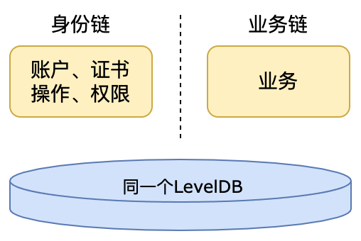

## 多链协同

### 应用模式

  * 单链管理账户、证书以及操作权限，同时负责业务

    

    1.使用默认配置的levelDB

    2.要构建创世块，运行`src/main/scala`目录下`rep.utils.CreateGenesisInfo`，生成的创世块文件在`json/identity-net/genesis.json`（身份链）

    使用示例：[https://gitee.com/BTAJL/RCJava-core/blob/master/src/test/java/com/rcjava/did](https://gitee.com/BTAJL/RCJava-core/blob/master/src/test/java/com/rcjava/did)

  * 身份链管理账户、证书以及操作权限，业务链只负责业务

    

    1.要配置为共享levelDB
    2.要分别构建身份链和业务链的创世块，运行`src/main/scala`目录下`rep.utils.CreateGenesisInfo`（身份链）和`rep.utils.CreateGenesisInfo4NoTransaction`（业务链），生成的创世块文件分别在`json/identity-net/genesis.json`（身份链）和`json/credence-net/genesis.json`（业务链）

    使用示例：[https://gitee.com/BTAJL/RCJava-core/blob/master/src/test/java/com/rcjava/multi_chain/MultiChainTest.java](https://gitee.com/BTAJL/RCJava-core/blob/master/src/test/java/com/rcjava/multi_chain/MultiChainTest.java)

  * 身份链管理账户、证书，业务链管理操作权限并负责业务

    

    1.要配置为共享levelDB
    2.要分别构建身份链和业务链的创世块，运行`src/main/scala`目录下`rep.utils.identity.CreateIdentityGenesisInfo` （身份链） 和`rep.utils.credence.CreateCredenceGenesisInfo`（业务链），生成的创世块文件分别在`json/identity-net/genesis.json`（身份链）和`json/credence-net/genesis.json`（业务链）

    使用示例：[https://gitee.com/BTAJL/RCJava-core/blob/master/src/test/java/com/rcjava/multi_chain/MultiChainSeparateTest.java](https://gitee.com/BTAJL/RCJava-core/blob/master/src/test/java/com/rcjava/multi_chain/MultiChainSeparateTest.java)

 配置文件如下所示，`identity-net`为身份链标识，`credence-net`为业务链标识，node1参与身份链组网，node6参与业务链组网，node1和node6的LevelDB配置为同一个存储目录，node6的`basic_chain_id`为身份链：

  > ```yaml
  > // 身份链参考conf/121000005l35120456.node1/system.conf
  > system {
  > chain_network_id = "identity-net" #组网id，组网id的命名不能包含"_"这样的字符
  > basic_chain_id = "identity-net"   #账户、证书身份全部交由自己管理
  > }
  > storage {
  > db_type = "LevelDB" #支持数据库的类型：LevelDB、RocksDB
  > db_path = "./repchaindata/data/leveldbdata"
  > db_name = "215159697776981712.node1"
  > db_cache_size=48 #数据库读写缓存，单位为M
  > 
  > block_file_type = "localFileSystem"
  > block_file_path = "./repchaindata/data/blockdata"
  > block_file_name = "215159697776981712.node1"
  > file_max_length = 100 #单位为M
  > }
  > ```

  > ```yaml
  > // 业务链参考conf/330597659476689954.node6/system.conf
  > system {
  > chain_network_id = "credence-net" #组网id，组网id的命名不能包含"_"这样的字符
  > basic_chain_id = "identity-net"   #账户、证书交由identity-net管理
  > }
  > storage {
  > db_type = "LevelDB" #支持数据库的类型：LevelDB、RocksDB
  > db_path = "./repchaindata/data/leveldbdata"
  > db_name = "215159697776981712.node1"
  > db_cache_size=48 #数据库读写缓存，单位为M
  > 
  > block_file_type = "localFileSystem"
  > block_file_path = "./repchaindata/data/blockdata"
  > block_file_name = "215159697776981712.node1"
  > file_max_length = 100 #单位为M
  > }
  > ```

## 术语

* 账户

  用户要使用区块链，必须先在RepChain上注册一个账户。

* 证书

  被RepChain用于验证用户提交的签名交易。一个账户下可以注册多个数字证书，账户与证书为一对多的关系

* 操作

  只要是涉及到签名交易，都具体到某一个**操作**上，操作分**<u>公开与非公开</u>**，如果操作被注册为<u>”公开“，不需要授权给其他用户，其他用户也可以调用</u>，如果被注册为”非公开“，则其他用户需要得到授权才能调用。一个账户下，可以注册多个操作，账户与操作为一对多的关系

  **注：结合交易的三种类型（部署合约、修改合约状态和调用合约）来理解**

* 授权

  将用户**自有的操作**或**别人授权给自己且可以再次让渡**的操作，授权给别人。一个账户下可以有多个被授权的操作，账户与被授权的操作为一对多的关系

## 账户权限管理

RepChain-v2.0.0通过**权限管理合约**（默认内置的系统合约，合约名：`RdidOperateAuthorizeTPL`，版本号：`1`）来管理用户身份（账户、权限等），目前合约里定义的所有方法如下表所示：

> 是否公开："否"表示用户调用该方法需要被授权，"是"表示用户调用该方法无需被授权

| 合约方法名                       | 用途描述                         | 是否公开 | 方法形参                                                     |
| :------------------------------- | :------------------------------- | :------: | ------------------------------------------------------------ |
| `signUpSigner`                   | 注册账户                         |    否    | rep.proto.rc2.Signer                                         |
| `updateSigner`                   | 更新账户                         |    否    | rep.proto.rc2.Signer                                         |
| `updateSignerStatus`             | 修改账户状态，禁用/启用          |    否    | SignerStatus(creditCode: String, state: Boolean)             |
| `signUpCertificate`              | 注册普通证书                     |    是    | rep.proto.rc2.Certificate                                    |
| `updateCertificateStatus`        | 修改普通证书状态                 |    是    | CertStatus(creditCode: String, certName: String, state: Boolean) |
| `signUpAllTypeCertificate`       | 注册身份/普通证书                |    否    | rep.proto.rc2.Certificate                                    |
| `updateAllTypeCertificateStatus` | 修改身份/普通证书状态            |    否    | CertStatus(creditCode: String, certName: String, state: Boolean) |
| `signUpOperate`                  | 为用户自己注册操作               |    是    | rep.proto.rc2.Operate                                        |
| `updateOperateStatus`            | 修改操作状态，禁用/启用          |    是    | OperateStatus(opId: String, state: Boolean)                  |
| `grantOperate`                   | 授权（让渡权限）给其他用户       |    是    | List[AuthorizeString]]                                       |
| `updateGrantOperateStatus`       | 更新授权状态，禁用/启用          |    是    | AuthorizeStatus(authId: String, state: Boolean)              |
| `bindCertToAuthorize`            | 将权限绑定到用户具体的某个证书 |    是    | rep.proto.rc2.BindCertToAuthorize                            |

* 上面列举的所有方法（操作）都已经在通过创世块注册到了super_admin（`"identity-net:951002007l78123233"`）的账户下
* super_admin可以将非公开的方法授权给其他注册用户（授权时，可以设置为允许/禁止该用户再次让渡给其他用户）
* 部分形参结构体在RepChain项目的`src/main/protobuf/rc2.proto`里定义

### 账户

账户作为用户在链上的身份权限的载体，主要组成部分如下图所示，账户ID是唯一标识，一个账户下可包含多个证书、多个操作、多个被授权的操作。


#### 注册账户

合约方法：`signUpSigner`，非公开，需要授权，因此只要有调用`"signUpSigner"`方法的权限即可为新用户注册账户

* 账户ID命名规范

  > `NetWorkID:UUID`，如：`"identity-net:121000005l35120456"`

* 注册流程

  > 举例说明：现有用户A、B，用户A想为用户B注册账户
  >
  > 分析：首先用户A要取得可以调用`signUpSigner`的权限
  >
  > 方案之一：step1：superAdmin（或具有且可继续让渡该权限的其他用户）要先授权用户A调用`signUpSigner`的权限；step2：用户A调用`signUpSigner`为用户B注册账户

  

  下面以使用`identity-net:951002007l78123233`（superAdmin）直接构造签名交易来调用权限管理合约为新用户注册账户（`"identity-net:usr-0"`）为例（基于RCJava-core）

  * step1：用户usr-0自己生成密钥对以及证书`usr-0_0.cer`（自签名或CA签发）
  * step2：用户usr-0将step1生成的证书`usr-0_0.cer`交给具有注册账户权限的用户（如super_admin）
  * step3：super_admin调用权限管理合约为用户usr-0注册账户`identity-net:usr-0`

  ```java
  TranPostClient postClient = new TranPostClient("localhost:9081");
  ChainInfoClient infoClient = new ChainInfoClient("localhost:9081");
  
  // 账户权限管理合约
  ChaincodeId didChaincodeId = ChaincodeId.newBuilder().setChaincodeName("RdidOperateAuthorizeTPL").setVersion(1).build();
  // 构造管理员的私钥
  PrivateKey super_pri = CertUtil.genX509CertPrivateKey(new File("jks/identity-net/951002007l78123233.super_admin.jks"),
                  "super_admin", "951002007l78123233.super_admin").getPrivateKey();
  TranCreator superCreator = TranCreator.newBuilder().setPrivateKey(super_pri).setSignAlgorithm("SHA256withECDSA").build();
  CertId superCertId = CertId.newBuilder().setCreditCode("identity-net:951002007l78123233").setCertName("super_admin").build();
  
  // 证书pem字符串
  String certPem = new String(Files.readAllBytes(new File("jks/test/did/usr-0_0.cer").toPath()));
  Peer.Certificate cert_proto = Peer.Certificate.newBuilder()
          // 新用户usr-0的证书<Pem字符串>
          .setCertificate(certPem)
          .setAlgType("sha256withecdsa")
          .setCertValid(true)
          .setCertType(Peer.Certificate.CertType.CERT_AUTHENTICATION)
          // 设置CertId，<账户ID>和<证书别名>
          .setId(Peer.CertId.newBuilder().setCreditCode("identity-net:usr-0").setCertName("0").build())
          .setCertHash(DigestUtils.sha256Hex(certPem.replaceAll("\r\n|\r|\n|\\s", "")))
          .build();
  
  Peer.Signer usr0_signer = Peer.Signer.newBuilder()
          .setName("usr-0")
          // 用户usr-0的账户ID
          .setCreditCode("identity-net:usr-0")
          .setMobile("18888888888")
          // 注册账户时，要附带一个数字证书（身份证书）
          .addAllAuthenticationCerts(Collections.singletonList(cert_proto))
          .setSignerValid(true)
          .build();
  
  // super_admin向身份链提交交易，注册用户，以便在业务链使用
  String tranId = UUID.randomUUID().toString();
  // 构造签名交易
  Peer.Transaction tran = superCreator.createInvokeTran(tranId, superCertId, didChaincodeId, signUpSigner, JsonFormat.printer().print(usr0_signer), 0, "");
  // 提交交易
  postClient.postSignedTran(tran);
  TimeUnit.SECONDS.sleep(5);
  // 查询交易上链执行结果
  Peer.TransactionResult tranResult = infoClient.getTranResultByTranId(tranId);
  Assertions.assertEquals(0, tranResult.getErr().getCode(), "没有错误，注册成功");
  ```

#### 禁用/启用账户

如果用户不再使用RepChain，或者由于某些原因需要禁用账户，可修改用户的账户状态，只要有调用`"updateSignerStatus"`的权限即可修改用户的账户状态，可执行禁用或启用

合约方法：`updateSignerStatus`，非公开，需要授权，被授权的用户才可调用

> 举例说明：现有用户A、B，用户A想禁用用户B的账户
>
> 分析：首先用户A要取得可以调用`updateSignerStatus`的权限
>
> 方案之一：step1：superAmdin（或具有且可继续让渡该权限的其他用户）要先授权用户A调用`updateSignerStatus`的权限；step2：用户A调用`updateSignerStatus`为禁用/启用用户B的账户


#### 代码示例

测试用例：[https://gitee.com/BTAJL/RCJava-core/blob/master/src/test/java/com/rcjava/did/SignerOperationTest.java](https://gitee.com/BTAJL/RCJava-core/blob/master/src/test/java/com/rcjava/did/SignerOperationTest.java)

### 证书

证书分为身份证书和普通证书，身份证书相对普通证书比较重要，因为身份证书对应的密钥对构造的签名交易，可以为本账户注册普通证书或修改普通证书的状态（有效性）


#### 注册证书

* 注册普通证书

  > 用户账户注册成功后，即可使用身份证书对应的密钥对构造签名交易，自行调用系统合约`RdidOperateAuthorizeTPL`中的`signUpCertificate`方法来为**自己**注册普通证书

  合约方法：`signUpCertificate`，公开，无需授权，任何注册用户均可调用

  > 举例说明：现有用户A，用户A想为用户A自己注册普通证书
  >
  > 用户A调用`signUpCertificate`即可为自己注册证书

  

* 注册身份/普通证书

  > 1. 注册账户时，会附带注册一个身份证书
  > 2. 除 1 之外，可在其他有需要的时候，通过调用系统合约`RdidOperateAuthorizeTPL`中的`signUpAllTypeCertificate`方法为一个有效账户（**自己或其他**）注册身份/普通证书

  合约方法：`signUpAllTypeCertificate`，非公开，需要授权，被授权的用户才可调用

  > 举例说明：现有用户A、B，用户A想为用户A或B注册身份/普通证书
  >
  > 分析：首先用户A要取得可以调用`signUpAllTypeCertificate`的权限
  >
  > 方案之一：step1：superAdmin（或具有且可继续让渡该权限的其他用户）要先授权用户A调用`signUpAllTypeCertificate`的权限；step2：用户A调用`signUpAllTypeCertificate`为用户A/B注册身份/普通证书

  

  ```java
  // 授权，super授权给usr0, 注册任意证书的方法
  long millis = System.currentTimeMillis();
  Peer.Authorize authorize = Peer.Authorize.newBuilder()
          .setId("identity-net:" + UUID.randomUUID())
          .setGrant("identity-net:951002007l78123233")
          .addGranted("identity-net:usr-0")
          .addOpId(DigestUtils.sha256Hex("identity-net:RdidOperateAuthorizeTPL.signUpAllTypeCertificate"))
          // 设置是否可继续让渡
          .setIsTransfer(Peer.Authorize.TransferType.TRANSFER_REPEATEDLY)
          .setCreateTime(Timestamp.newBuilder().setSeconds(millis / 1000).setNanos((int) ((millis % 1000) * 1000000)).build())
          .setAuthorizeValid(true)
          .setVersion("1.0")
          .build();
  String tranId = UUID.randomUUID().toString();
  // 授权给usr-0
  Peer.Transaction tran = node1Creator.createInvokeTran(tranId, superCertId, didChaincodeId, grantOperate,
          JSONObject.toJSONString(Collections.singletonList(JsonFormat.printer().print(authorize))), 0, "");
  postClient.postSignedTran(tran);
  TimeUnit.SECONDS.sleep(2);
  Peer.TransactionResult tranResult = getTransactionResult(tranId);
  Peer.ActionResult actionResult = tranResult.getErr();
  Assertions.assertEquals(0, actionResult.getCode(), "没有错误，授权成功");
  
  // step2: usr0为usr1 注册身份证书
  Peer.Certificate usr1_cert_1 = Peer.Certificate.newBuilder()
                      .setCertificate(certPem)
                      .setAlgType("sha256withecdsa")
                      .setCertValid(true)
     									// 设置证书类型，证书类型为身份证书
                      .setCertType(Peer.Certificate.CertType.CERT_AUTHENTICATION)
    									// 证书名根据自己需要设置
                      .setId(Peer.CertId.newBuilder().setCreditCode("identity-net:usr-1").setCertName("0").build())
                      .setCertHash(DigestUtils.sha256Hex(certPem.replaceAll("\r\n|\r|\n|\\s", "")))
                      .build();;
  String tranId_1 = UUID.randomUUID().toString();
  // 构造交易
  Peer.Transaction tran_1 = usr0_tranCreator_0.createInvokeTran(tranId_1, usr0_certId_0, didChaincodeId, signUpAllTypeCertificate, JsonFormat.printer().print(usr1_cert_1), 0, "");
  postClient.postSignedTran(tran_1);
  TimeUnit.SECONDS.sleep(2);
  Peer.TransactionResult tranResult_1 = getTransactionResult(tranId_1);
  Peer.ActionResult actionResult_1 = tranResult_1.getErr();
  Assertions.assertEquals(0, tranResult_1.getErr().getCode(), "没有错误，注册成功");
  ```

#### 禁用/启用证书

如果用户私钥丢失，或者不想再使用某个私钥，可以将在链上的、与私钥对应的证书禁用掉；后续找回或者想启用私钥时，可以恢复证书状态

* 禁用/启用普通证书

  > 用户使用自己**身份证书**对应的密钥构建的签名交易，可以调用`updateCertificateStatus`方法来修改**自己**账户下的普通证书的状态

  合约方法：`updateCertificateStatus`，公开，无需授权，任何注册用户均可调用，但是要注意，需使用自己**身份证书对应的密钥**来构建签名交易，并且只能修改**自己**账户下的普通证书状态

  > 举例说明：现有用户A，用户A想禁用用户A自己的普通证书
  >
  > 用户A调用`updateCertificateStatus`即可禁用自己的普通证书

  

* 禁用/启用身份/普通证书

  合约方法：`updateAllTypeCertificateStatus`，非公开，需要授权，用户调用该方法可修改**自己或其他人**账户下的的身份证书或普通证书的状态

  > 举例说明：现有用户A、B，用户A想禁用用户A的普通证书，以及禁用用户B的身份证书
  >
  > 分析：首先用户A要取得可以调用`updateAllTypeCertificateStatus`的权限
  >
  > 可选方案之一：step1：superAmdin（或具有且可继续让渡该权限的其他用户）要先授权用户A调用`updateAllTypeCertificateStatus`的权限；step2：用户A调用`updateAllTypeCertificateStatus`禁用用户B的身份证书以及A的普通证书

  
#### 代码示例

测试用例：[https://gitee.com/BTAJL/RCJava-core/blob/master/src/test/java/com/rcjava/did/CertOpeartionTest.java](https://gitee.com/BTAJL/RCJava-core/blob/master/src/test/java/com/rcjava/did/CertOpeartionTest.java)

### 操作

每个账户下可以有如下三类操作，且每个类型可以有多个操作

* 部署合约、修改合约状态
* 合约中具体的某个方法
* RepChain API中具体的某个接口


#### 注册操作

注册合约中具体的某个方法，只有注册之后，用户才可以通过签名交易调用该方法，并且将该操作授权给其他用户后，其他用户也得到了调用该方法的权限

* 操作ID命名规范

  > sha256(操作名)，操作名的规范请参见下文

* 操作命名规范

  * API，只能由superAdmin来注册
    * `NetWorkID:transaction.postTranByString`，如：`"identity-net:transaction.postTranByString"`
* 部署合约，只能由superAdmin来注册，之后再授权给别的用户
    * `NetWorkID:ContractName.deploy`，如：`"identity-net:CredenceTPL.deploly"`，只能部署名为`CredenceTPL`的合约
    * `NetWorkID:*.deploy`，如：`"identity-net:*.deploly"`，部署任何合约，在创世块中已注册到super_admin账户下
  * 修改合约状态，只能由superAdmin来注册，之后再授权给别的用户
    * `NetWorkID:ContractName.setState`，如：`"identity-net:CredenceTPL.setState"`，只能修改名为`CredenceTPL`的合约状态
    * `NetWorkID:*.setState`，如：`"identity-net:*.setState"`，修改任何合约状态，在创世块中注册到super_admin账户下
  * 合约操作，**具有合约部署权限**的用户，就可以注册
    * `NetWorkID:ContractName.MethodName`，如：`"identity-net:CredenceTPL.proof"`，名为`CredenceTPL`的合约中的名为`proof`的方法
  

方法：`signUpOperate`，公开，无需授权，任何注册用户均可调用，但是要注意，用户想要注册某合约里的方法，有一个前提条件，即用户拥有该合约的部署权限。

> 举例说明：现有用户A、B，用户A想部署合约TestProofTPL.scala，进而注册合约中的方法method_1，用户B想注册合约中的方法method_2
  >
  > 分析：只要用户A和用户B获得可以部署合约TestProofTPL.scala的权限即可
  >
  > 可选择方案之一：step1：superAmdin注册`"identity-net:TestProofTPL.deploy"`操作到自己账户；step2：授权用户A `"identity-net:TestProofTPL.deploy"`的权限，授予用户B `"identity-net:*.deploy"`的权限；step3：用户A部署合约TestProofTPL.scala；step4：用户A注册`"identity-net:TestProofTPL.method_1"`，用户B注册`"identity-net:TestProofTPL.method_2"`


#### 禁用/启用操作

操作状态的修改具有全局性和传递性，即操作的注册者，将操作禁用后，所有被授权该操作的用户，后续都将无法使用该操作

方法：`updateOperateStatus`，公开，无需授权，任何用户均可调用，用户想要禁用合约里的某个方法，有一个前提条件，即用户拥有该合约的部署权限，如下图所示，账户B具有`"identity-net:*.deploly"`，账户A具有`"identity-net:cName.deploy"`，禁用操作后，所有用户均不可再调用执行cName.method_1与cName.method_2了


#### 代码示例

测试用例：[https://gitee.com/BTAJL/RCJava-core/blob/master/src/test/java/com/rcjava/did/OperOperationTest.java](https://gitee.com/BTAJL/RCJava-core/blob/master/src/test/java/com/rcjava/did/OperOperationTest.java)

### 授权

用户可将自己账户下的操作或别人让渡给自己的有效的且可以再次让渡的操作授权给别的用户，在RepChain的所有账户集合里，各个账户之间可以相互授权，每个授权都有唯一ID

授权ID命名规范

> `NetWorkID:UUID`，如：`"identity-net:auth-usr-0-to-usr-1"`


#### 让渡操作

方法：`grantOperate`，公开，无需授权，任何用户均可调用

> 举例说明：账户B有操作`"identity-net:TestProofTPL.method_2"`，账户A有操作`"identity-net:TestProofTPL.method_1"`，账户B在为账户D授权时，设置为不可继续让渡，账户A为账户C授权时，设置为可继续让渡，因此最终D不可将`"identity-net:TestProofTPL.method_2"`继续让渡给账户E，而账户C可以继续将`"identity-net:TestProofTPL.method_1"`让渡给账户E


#### 禁用/启用授权

禁用/启用授权不具有全局性和传递性，假设A授权给B用户一个可以再次让渡的权限，B继续授权给C，A将给B的授权禁用，不影响C的使用

方法：`updateGrantOperateStatus`，公开，无需授权，任何用户均可调用

> 举例说明：现有用户A，C，用户A想禁用用户A给C的某个授权
>
> 用户A调用`updateGrantOperateStatus`可禁用给C的授权`"identity-net:cName.method_1"`，之后C不可以再调用该方法


#### 绑定授权到证书

用户可将别的用户授予给自己的权限绑定到账户下的某个具体证书上，之后，用户使用该证书对应的私钥对构造的签名交易可通过该权限验证，其他证书对应的私钥构造的签名交易不可以通过该权限验证

方法：`bindCertToAuthorize`，公开，无需授权，任何用户均可调用

> 举例说明：基于上一小节的权限让渡操作之后，现有用户C，用户C有两个证书"cert_0"和"cert_1"，两个证书分别对应的私钥"pri_1"与"pri_2"构造的签名交易都可以调用`"cName.method_1"`，当C将A授予给他的权限绑定到证书"cert_0"后，则只能"pri_1"构造的签名交易**可以**调用`"cName.method_1"`，"pri_2"构造的签名交易**不可以**调用`"cName.method_1"`


#### 代码示例

测试用例：[https://gitee.com/BTAJL/RCJava-core/blob/master/src/test/java/com/rcjava/did/AuthOperationTest.java](https://gitee.com/BTAJL/RCJava-core/blob/master/src/test/java/com/rcjava/did/AuthOperationTest.java)

##SDK使用

### RCJava-core


新用户从注册上链到调用合约方法时，使用RCJava-core的逻辑如上图所示，该逻辑具有顺序性，后续操作需要在前置操作已完成的基础上进行。在身份链管理账户、证书以及操作权限，业务链只负责业务的多链模型中，以`identity-net:951002007l78123233`（super_admin）直接构造签名交易来调用权限管理合约为新用户usr-0（`"identity-net:usr-0"`）注册并授权为例，操作流程如下：

* step1：用户usr-0自己生成密钥对以及证书`usr-0_0.cer`（自签名或CA签发）
* step2：用户usr-0将step1生成的证书`usr-0_0.cer`交给具有注册账户权限的用户（如super_admin）
* step3：super_admin调用权限管理合约向身份链去注册用户usr-0，此步骤中usr-0的账户以及证书都被注册了
* step4：super_admin向身份链去注册可以部署合约credence-net:CredenceTPL.deploy的操作
* step5：super_admin授权给usr-0可部署合约credence-net:CredenceTPL.deploy的权限
* step6：usr-0具有了向业务链部署CredenceTPL的权限，因此向业务链部署合约
* step7：usr-0作为合约部署者，注册合约的某个方法
* step8：usr-0调用业务链中刚部署的合约，存证数据

上述流程的使用示例如下，完整代码请访问[RCJava-core](https://gitee.com/BTAJL/RCJava-core)项目的`src\test\java\com\rcjava\did`目录：

```java
//以下示例为身份链管理账户、证书以及操作权限，业务链只负责业务的多链模型，若为单链模式：
//1.需将代码中的业务链前缀“credence-net”改为身份链前缀"identity-net"
//2.需将提交至<业务链>“postCredenceClient”的交易改为“提交至<身份链>“postClient”
@TestMethodOrder(MethodOrderer.OrderAnnotation.class)
@TestInstance(TestInstance.Lifecycle.PER_CLASS)
public class Test {

    // 身份链
    TranPostClient postClient = new TranPostClient("localhost:9081");
    ChainInfoClient infoClient = new ChainInfoClient("localhost:9081");

    // 业务链
    TranPostClient postCredenceClient = new TranPostClient("localhost:9086");
    ChainInfoClient infoCredenceClient = new ChainInfoClient("localhost:9086");

    // superAdmin
    TranCreator superCreator;
    Peer.CertId superCertId;

    // 新用户usr0
    TranCreator usr0_tranCreator_0;
    Peer.CertId usr0_certId_0;
    
    //账户权限管理合约
    Peer.ChaincodeId didChaincodeId = Peer.ChaincodeId.newBuilder().setChaincodeName("RdidOperateAuthorizeTPL").setVersion(1).build();
    Peer.ChaincodeId credenceTPLId = Peer.ChaincodeId.newBuilder().setChaincodeName("CredenceTPL").setVersion(1).build();


    @BeforeAll
    void init() {
        //构造管理员的私钥
        PrivateKey super_pri = CertUtil.genX509CertPrivateKey(new File("jks/test/multi_chain/identity.951002007l78123233.super_admin.jks"),
                "super_admin", "951002007l78123233.super_admin").getPrivateKey();
        superCreator = TranCreator.newBuilder().setPrivateKey(super_pri).setSignAlgorithm("SHA256withECDSA").build();
        superCertId = Peer.CertId.newBuilder().setCreditCode("identity-net:951002007l78123233").setCertName("super_admin").build();
        
        //构造usr0的私钥
        //使用KeyStoreExplorer工具或者使用代码实例(https://gitee.com/BTAJL/RCJava-core/blob/master/src/main/java/com/rcjava/util/CertUtil.java)即可生成密钥对，导出证书
        PrivateKey usr0_pri = CertUtil.genX509CertPrivateKey(new File("jks/test/did/usr-0_0.jks"), "123", "usr_0_0").getPrivateKey();
        usr0_tranCreator_0 = TranCreator.newBuilder().setPrivateKey(usr0_pri).setSignAlgorithm("SHA256withECDSA").build();
        usr0_certId_0 = Peer.CertId.newBuilder().setCreditCode("credence-net:usr-0").setCertName("0").build();
    }

    @Test
    @DisplayName("super_admin向身份链去注册用户usr-0，该步骤注册了usr-0的账户以及证书")
    @Order(1)
       void signUpSignerTest() throws InterruptedException, IOException {

        // 证书pem字符串
        String certPem = new String(Files.readAllBytes(new File("jks/test/did/usr-0_0.cer").toPath()));
        Peer.Certificate cert_proto = Peer.Certificate.newBuilder()
                // 新用户usr-0的证书
                .setCertificate(certPem)
                .setAlgType("sha256withecdsa")
                .setCertValid(true)
                .setCertType(Peer.Certificate.CertType.CERT_AUTHENTICATION)
                .setId(Peer.CertId.newBuilder().setCreditCode("credence-net:usr-0").setCertName("0").build())
                .setCertHash(DigestUtils.sha256Hex(certPem.replaceAll("\r\n|\r|\n|\\s", "")))
                .build();

        Peer.Signer usr0_signer = Peer.Signer.newBuilder()
                .setName("usr-0")
                // 新用户usr-0的账户ID
                .setCreditCode("credence-net:usr-0") // 新注册用户   业务链前缀，credence-net:*****.usr-11
                .setMobile("18888888888")
                .addAllAuthenticationCerts(Collections.singletonList(cert_proto))
                .setSignerValid(true)
                .build();

        // super_admin向身份链提交交易，注册用户，以便在业务链使用
        String tranId_1 = UUID.randomUUID().toString();
        Peer.Transaction tran_1 = superCreator.createInvokeTran(tranId_1, superCertId, didChaincodeId, signUpSigner, JsonFormat.printer().print(usr0_signer), 0, "");
        postClient.postSignedTran(tran_1);
        TimeUnit.SECONDS.sleep(5);
        Peer.TransactionResult tranResult_1 = infoClient.getTranResultByTranId(tranId_1);
        Assertions.assertEquals(0, tranResult_1.getErr().getCode(), "没有错误，注册成功");
    }

    @Test
    @DisplayName("super_admin注册Operate-可以部署合约CredenceTPL.deploy的操作")
    @Order(2)
    void signUpOperate() throws InterruptedException, IOException {

        // super_admin注册部署合约credence-net:CredenceTPL.deploy的操作，向<身份链>提交
        //若为身份链管理账户、证书，业务链管理操作权限并负责业务的多链模型，则向<业务链>提交，将该段代码中的身份链前缀"identity-net"改为业务链前缀“credence-net”
        //将提交至<身份链>“postClient”的交易改为“提交至<业务链>“postCredenceClient”
        long millis_1 = System.currentTimeMillis();
        Peer.Operate operate = Peer.Operate.newBuilder()
                .setOpId(DigestUtils.sha256Hex("credence-net:CredenceTPL.deploy"))
                .setDescription("部署存证合约-CredenceTPL的权限")
                .setRegister("identity-net:951002007l78123233")
                .setIsPublish(false)
                .setOperateType(Peer.Operate.OperateType.OPERATE_CONTRACT)
                .setAuthFullName("credence-net:CredenceTPL.deploy")
                .setCreateTime(Timestamp.newBuilder().setSeconds(millis_1 / 1000).setNanos((int) ((millis_1 % 1000) * 1000000)).build())
                .setOpValid(true)
                .setVersion("1.0")
                .build();
        String tranId_2 = UUID.randomUUID().toString();
        Peer.Transaction tran_2 = superCreator.createInvokeTran(tranId_2, superCertId, didChaincodeId, signUpOperate, JsonFormat.printer().print(operate), 0, "");
        postClient.postSignedTran(tran_2);
        TimeUnit.SECONDS.sleep(5);
        Peer.TransactionResult tranResult_2 = infoClient.getTranResultByTranId(tranId_2);
        Peer.ActionResult actionResult_2 = tranResult_2.getErr();
        Assertions.assertEquals(0, actionResult_2.getCode(), "没有错误，操作注册成功");

    }

    @Test
    @DisplayName("super_admin授权给credence-net:usr-0可部署CredenceTPL的权限")
    @Order(3)
    void grantOperate() throws InterruptedException, IOException {

        //super_admin授权给usr0部署合约("credence-net:CredenceTPL.deploy")的权限，向<身份链>提交
        //若为身份链管理账户、证书，业务链管理操作权限并负责业务的多链模型，则向<业务链>提交，将该段代码中的身份链前缀"identity-net"改为业务链前缀“credence-net”
        //将提交至<身份链>“postClient”的交易改为“提交至<业务链>“postCredenceClient”
        long millis = System.currentTimeMillis();
        Peer.Authorize authorize_1 = Peer.Authorize.newBuilder()
                .setId("credence-net:" + UUID.randomUUID())
                .setGrant("identity-net:951002007l78123233")  // 授权者，这里是super_admin
                .addGranted("credence-net:usr-0")   // 被授权者 usr-0
                //此处合约为CredenceTPL，后续部署其他合约需要修改
            	.addOpId(DigestUtils.sha256Hex("credence-net:CredenceTPL.deploy"))  
                // 权限让渡，此处代表usr-0可以继续授权给别人
            	.setIsTransfer(Peer.Authorize.TransferType.TRANSFER_REPEATEDLY) 
                .setCreateTime(Timestamp.newBuilder().setSeconds(millis / 1000).setNanos((int) ((millis % 1000) * 1000000)).build())
                .setAuthorizeValid(true)
                .setVersion("1.0")
                .build();

        String tranId_3 = UUID.randomUUID().toString();
        Peer.Transaction tran_3 = superCreator.createInvokeTran(tranId_3, superCertId, didChaincodeId, grantOperate,
                JSONObject.toJSONString(Collections.singletonList(JsonFormat.printer().print(authorize_1))), 0, "");
        postClient.postSignedTran(tran_3);
        TimeUnit.SECONDS.sleep(5);
        Peer.TransactionResult tranResult_3 = infoClient.getTranResultByTranId(tranId_3);
        Peer.ActionResult actionResult_3 = tranResult_3.getErr();
        Assertions.assertEquals(0, actionResult_3.getCode(), "没有错误，授权成功");
    }

    @Test
    @DisplayName("usr-0具有了向业务链部署CredenceTPL的权限，因此向业务链部署合约")
    @Order(4)
    void testDeployContract() throws InterruptedException, IOException {
        // 向业务链提交，部署合约
        String tplString = FileUtils.readFileToString(new File("jks/test/tpl/CredenceTPL.scala"), StandardCharsets.UTF_8);
        Peer.ChaincodeDeploy chaincodeDeploy = Peer.ChaincodeDeploy.newBuilder()
                .setTimeout(5000)
                .setCodePackage(tplString)
                .setLegalProse("")
                .setCType(Peer.ChaincodeDeploy.CodeType.CODE_SCALA)
                .setRType(Peer.ChaincodeDeploy.RunType.RUN_SERIAL)
                .setSType(Peer.ChaincodeDeploy.StateType.STATE_BLOCK)
                .setInitParameter("")
                .setCclassification(Peer.ChaincodeDeploy.ContractClassification.CONTRACT_CUSTOM)
                .build();
        DeployTran deployTran = DeployTran.newBuilder()
                .setTxid(UUID.randomUUID().toString())
                .setCertId(usr0_certId_0)
                .setChaincodeIdScredenceTPLId)
                .setChaincodeDeploy(chaincodeDeploy)
                .build();

        // 此步骤中usr0部署合约成功
        DeployTran deployTran_1 = deployTran.toBuilder().setTxid(UUID.randomUUID().toString()).build();
        Peer.Transaction signedDeployTran_1 = usr0_tranCreator_0.createDeployTran(deployTran_1);
        postCredenceClient.postSignedTran(signedDeployTran_1);
        TimeUnit.SECONDS.sleep(5);
        Peer.TransactionResult tranResult_4 = infoCredenceClient.getTranResultByTranId(signedDeployTran_1.getId());
        Peer.ActionResult actionResult_4 = tranResult_4.getErr();
        Assertions.assertEquals(0, actionResult_4.getCode(), "没有错误，合约部署成功");
    }

    @Test
    @DisplayName("usr-0，作为合约部署者，注册合约里的Operate-注册合约的某个方法")
    @Order(5)
    void testSignUpOperate_1() throws InterruptedException, InvalidProtocolBufferException {

        // usr0注册合约的某个方法的Operate成功，向身份链提交
         //若为身份链管理账户、证书，业务链管理操作权限并负责业务的多链模型，则向<业务链>提交，将该段代码中的身份链前缀"identity-net"改为业务链前缀“credence-net”
        //将提交至<身份链>“postClient”的交易改为“提交至<业务链>“postCredenceClient”
        long millis = System.currentTimeMillis();
        Peer.Operate operate = Peer.Operate.newBuilder()
                // 合约的某个方法
                .setOpId(DigestUtils.sha256Hex("credence-net:CredenceTPL.creProof3"))
                // 描述随意
                .setDescription("CredenceTPL.creProof3")
                .setRegister("credence-net:usr-0")
                // setIsPublish设置方法是否公开，比如新注册了一个用户usr-1，如果是false的话，usr-1需要被授权才能调用creProof3
                // 如果设置true，新注册的任何用户，都可以调用这个方法
                //也即，false则别的用户需要得到授权才可以调用，true则表示公开，任何人(注册用户)都可以调用
                .setIsPublish(true)
                .setOperateType(Peer.Operate.OperateType.OPERATE_CONTRACT)
                .setAuthFullName("credence-net:CredenceTPL.creProof3") // 假设CredenceTPL 有多个版本
                .setCreateTime(Timestamp.newBuilder().setSeconds(millis / 1000).setNanos((int) ((millis % 1000) * 1000000)).build())
                .setOpValid(true)
                .setVersion("1.0")
                .build();
        String tranId = UUID.randomUUID().toString();
        Peer.Transaction tran = usr0_tranCreator_0.createInvokeTran(tranId, usr0_certId_0, didChaincodeId, signUpOperate, JsonFormat.printer().print(operate), 0, "");
        // 向身份链提交
        postClient.postSignedTran(tran);
        TimeUnit.SECONDS.sleep(5);
        Peer.TransactionResult tranResult = infoClient.getTranResultByTranId(tranId);
        Peer.ActionResult actionResult = tranResult.getErr();
        Assertions.assertEquals(0, actionResult.getCode(), "没有错误，操作注册成功");
    }

    @Test
    @DisplayName("调用业务链中刚部署的合约，存证数据")
    @Order(6)
    void testCredenceProof() throws InterruptedException {
        // usr0提交存证交易，向业务链提交
        String tranId = UUID.randomUUID().toString();
        Peer.Transaction tran = usr0_tranCreator_0.createInvokeTran(tranId, usr0_certId_0, credenceTPLId,
                "creProof3", String.format("{\"uuid\" : \"%s\",\"data\" : \"{\\\"data1\\\": \\\"xyb002\\\",\\\"data2\\\": \\\"xyb003\\\"}\"}", tranId), 0, "");
        String tranHex = Hex.encodeHexString(tran.toByteArray());
        postCredenceClient.postSignedTran(tranHex);
        TimeUnit.SECONDS.sleep(5);
        Peer.TransactionResult tranResult = infoCredenceClient.getTranResultByTranId(tranId);
        Peer.ActionResult actionResult = tranResult.getErr();
        Assertions.assertEquals(0, actionResult.getCode(), "存证成功");
    }
}

```

使用[KeyStoreExplorer](https://keystore-explorer.org/)（或者使用[代码](https://gitee.com/BTAJL/ToolCollection/blob/master/src/main/java/repchain/genjks/GenerateJks.java)）即可生成密钥对，导出证书


## 动态管理组网节点

在RepChain2.0.0之前，基于TLS1.2组网的RepChain的各个节点默认使用`mytruststore.jks`来保存信任证书列表（包含参与组网的所有节点证书），如果想要加入新的组网节点，有两种方案：

* 方案一：将网络里现有的所有节点的`mytruststore.jks`都更新（将新的节点的证书到如到该存储库），然后重启所有节点
* 方案二：在`mytruststore.jks`中预置多一些节点证书，这样无需重启网络，但是也无法预估预置多少合适

从上面两个方案可以看出，方式二比方式一稍微好一些，但是也不是一劳永逸

RepChain2.0.0实现了通过合约来管理组网节点的信任证书列表，调用合约对存放在链上的信任证书列表更新时，会触发RepChain重构TrustKeyStore（依据链上的信任证书列表），合约可以实现新增或删除节点证书：

* 对链上的信任证书列表增加新的节点证书，之后加入新的节点到现有网络时，网络里的所有节点会重构TrustKeyStore，新的节点就可以成功的与其他节点建立TLS连接

  > 测试用例：[https://gitee.com/BTAJL/RCJava-core/blob/master/src/test/java/com/rcjava/multi_chain/ManageNodeCertTest.java#L128](https://gitee.com/BTAJL/RCJava-core/blob/master/src/test/java/com/rcjava/multi_chain/ManageNodeCertTest.java#L128)

* 对链上的信任证书列表删除某个节点证书，网络里的所有节点会重构TrustKeyStore，并将相应的节点down掉

  > 测试用例：[https://gitee.com/BTAJL/RCJava-core/blob/master/src/test/java/com/rcjava/multi_chain/ManageNodeCertTest.java#L148](https://gitee.com/BTAJL/RCJava-core/blob/master/src/test/java/com/rcjava/multi_chain/ManageNodeCertTest.java#L148)

从上面方案可以真正的实现动态管理组网节点信任证书列表，以及动态管理组网节点


## 动态管理共识列表

RepChain2.0.0之前，基于配置里的抽签列表进行抽签选择出块人，如果想要修改抽签列表（共识节点列表），需要修改所有节点的配置，并重启整个网络

RepChain2.0.0实现了通过合约管理RepChain的共识抽签列表，无需再修改配置并重启整个网络了。

测试用例：[https://gitee.com/BTAJL/RCJava-core/blob/master/src/test/java/com/rcjava/multi_chain/ManageNodeCertTest.java#L149](https://gitee.com/BTAJL/RCJava-core/blob/master/src/test/java/com/rcjava/multi_chain/ManageNodeCertTest.java#L149)

## RepChain启动方式

### 单机多节点

```java
java -cp RepChain.jar rep.app.Repchain "***.nodex"
```

### 单机单节点

```java
// 可以设置多参数，分别为节点名
java -cp RepChain.jar rep.app.Repchain_Single "***.nodex"
```

### 节点管理服务

```java
// 第一个参数为管理服务的端口，第二个参数为是否开启ssl，第三个参数为是否开启ssl双向认证，之后的参数都为节点名
java -cp RepChain.jar rep.app.RepChain_Management 8080 0 false "***.node1"
```


## Q&A

* 判断交易是否上链

  > 查询交易在区块中的执行结果，即TransactionResult
