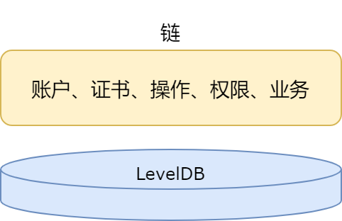
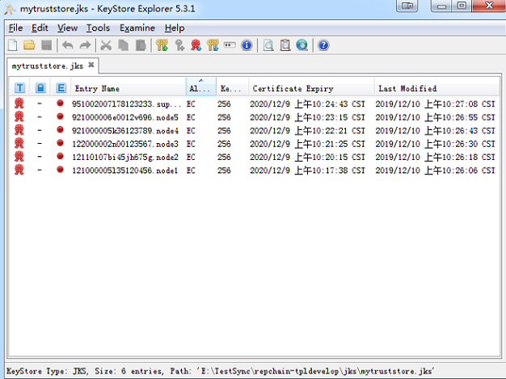

# RepChain部署

## ——单链模式

单链管理账户、证书以及操作权限，同时负责业务



1.使用默认配置的levelDB

2.要构建创世块，运行`src/main/scala`目录下`rep.utils.CreateGenesisInfo`，生成的创世块文件在`json/identity-net/genesis.json`（身份链）

* RepChain所支持的网络环境

  支持局域网、专网、公网部署，`NAT`或`docker`环境

* RepChain所支持的软硬件环境

  硬件环境：x86-64、Arm-64（如：鲲鹏服务器、树莓派）、RISK-V；软件环境：虚拟机、Docker

* 部署和运行RepChain节点的方式

  使用`jar`包部署，运行在JVM上（jdk11+，推荐jdk13+），基于JAVA的跨平台部署，RepChain支持部署在绝大部分的Windows、Linux与MacOS系统上
  
* RepChain的单链部署模式

  > 可以分为单机模拟多节点、分布式多机多节点、节点管理服务

  1.**单机模拟多节点**

  可以理解为一个进程中运行多个线程（节点），运行在同一宿主机上，一般在开发测试环境中使用该部署方式，用来测试RepChain代码或编写好的合约

  2.**分布式多机多节点**

  可以理解为每个节点是一个进程，各个节点分别部署在不同的宿主机上
    
  3.**节点管理服务**

  可以理解为一个进程中运行一个节点管理服务，可以在一个进程中运行多个线程（节点），也可以每个节点是一个进程

### 编译打包

* 环境需求：

  1.硬件的推荐配置：CPU：4核，Memory：8G，Disk：100G

  > 所述配置是推荐的**基础运行环境**的硬件配置，打包编译环境的配置可降低（可根据实际情况进行降低或提升配置）

  2.Java环境：Jdk-13，推荐[Azul-zuluJdk](https://www.azul.com/downloads/?version=java-13-mts&architecture=x86-64-bit&package=jdk)，也可使用[Oracle-Jdk](https://www.oracle.com/java/technologies/downloads/archive/)

  3.操作系统：可以安装Jdk-13的系统

  4.支持架构：x86-64、Arm-64（如：鲲鹏服务器、树莓派），目前也支持：RISC-V；如果是Arm-64架构，则需要替换RepChain代码默认所依赖的leveldbjni的包，替换方式参见后续的介绍

  5.[Git](https://git-scm.com/downloads)：用来下载RepChain的源码（非必须，可直接下载[压缩包](https://gitee.com/BTAJL/repchain/repository/archive/RepChain_1.1.0_RC)）

  6.编译工具：[Sbt](https://www.scala-sbt.org/download.html) ，安装方式见[官方教程](https://www.scala-sbt.org/1.x/docs/Setup.html)；<font color=#FF0000 >或</font> 安装了[Scala](https://plugins.jetbrains.com/plugin/1347-scala/versions/stable)插件的[IDEA](https://www.jetbrains.com/idea/download/#section=mac)，插件安装方式见[官方教程](https://www.jetbrains.com/help/idea/managing-plugins.html#required-plugins)

* 下载源码：

  1.如果有安装Git，且为Git配置了系统环境变量，则使用GitBash或者系统自带Terminal，依次输入如下命令：

```bash
     git clone https://gitee.com/BTAJL/repchain.git
     cd repchain
     git fetch
     git checkout -b dev_jdk13_2.0.0.0 RepChain_2.0.0_RC
```

  
  > 如不使用git，也可以直接下载[压缩包](https://gitee.com/BTAJL/repchain/repository/archive/RepChain_1.1.0_RC)，并解压为repchain
  
  2.找到repchain根目录下的build.sbt文件，修改build.sbt中的`mainClass`（Jar包主类），如果部署模式为[单机模拟多节点](#单机模拟多节点)，则修改为`rep.app.Repchain`，如果部署模式为[分布式多机多节点](#分布式多机多节点)，则修改为`rep.app.Repchain_Single`，如果部署模式为[节点管理服务](#节点管理服务)，则修改为`rep.app.RepChain_Management`，如下所示：
  
```shell
     # 单机模拟多节点
     mainClass in (Compile, packageBin) := Some("rep.app.Repchain")
     # 或
     # 分布式多机多节点
     mainClass in (Compile, packageBin) := Some("rep.app.Repchain_Single")
     # 或
     # 节点管理服务
     mainClass in (Compile, packageBin) := Some("rep.app.RepChain_Management")
```
  
  > RepChain默认使用的`leveldbjni`包不支持Arm-64，因此如果要将RepChain部署在Arm-64架构的服务器，需要将根目录下的build.sbt文件中配置的`leveldb-jni`依赖包替换（可以自己根据`leveldb-jni`的说明文档自行编译），如下所示：
  
```shell
     # 将
     libraryDependencies += "org.fusesource.leveldbjni" % "leveldbjni-all" % "1.8"
     # 替换为
     libraryDependencies += "com.github.huangtianhua" % "leveldbjni-linux64-aarch64" % "1.9"
     # 或
     libraryDependencies += "org.openlabtesting.leveldbjni" % "leveldbjni-linux64-aarch64" % "1.8"
```
  
  3.编译并打包
  
  > 有两种方式，一种是在IDEA中使用`sbt-shell`（安装了Scala插件后，即可使用该工具），另一种是在终端使用`sbt-repl`（安装了Sbt后，即可使用该工具），详细说明过程可参考后面的打包演示：
  
  * 在IDEA中打开`sbt shell`并进入交互界面后，依次输入如下命令：clean->compile->assembly，如下所示：
  
```shell
       sbt:RepChain> clean 
       sbt:RepChain> compile 
       sbt:RepChain> assembly
```
  
  * 在终端中使用`sbt-repl`，输入`sbt`命令进入交互界面后，依次输入如下命令：
  
```shell
       > clean 
       > compile 
       > assembly
```
  
  4.打包好的RepChain.jar存放在`repchain/target/scala-2.12/RepChain.jar`，将Jar包移动到项目根目录下
  
* 打包过程演示：

  1.使用IDEA中的`sbt-shell`

  

  2.使用终端（Terminal or cmd），下面以mac下的终端为例（Windows或Linux类似）

  

### 部署

在上一小节中，主要叙述了如何对RepChain的源码进行了编译并打包得到RepChain.jar，接下来使用RepChain.jar来部署RepChain网络，RepChain的部署有三种方式：一是单机模拟多节点；二是分布式多机多节点；三是节点管理服务。接下来分别做详细介绍

#### 单机模拟多节点

> 默认RepChain使用单机模拟身份链**5**节点，一般在开发测试环境中使用该部署方式，主要目的是用来测试RepChain代码或者编写好的合约，在同一个`Jvm`上模拟启动5个节点，启动主类为`rep.app.Repchain`


- 环境需求：
  
    - 硬件的基础配置：CPU：4核，Memory：8G
    - Java环境：Jdk-13，推荐[Azul-zuluJdk](https://www.azul.com/downloads/?version=java-13-mts&architecture=x86-64-bit&package=jdk)，也可使用[Oracle-Jdk](https://www.oracle.com/java/technologies/downloads/archive/)
  
- 配置文件

  > 以node1为例（node2-node5类似），配置文件为`repchain/conf/121000005l35120456.node1/system.conf`

  - `system.conf`中需要注意的配置项
    - 1.`system.httpServicePort= 9081` ，RepChain的http服务的端口 
    - 2.`system.contractOperationMode = 1`，以`jar`包模式运行RepChain，该配置项须改为1
    - 3.`system.trans_create_type=0` ，接受从API提交过来的交易（如果设置为1，代表的是节点自动产生并提交交易，主要是用来测试用）
    - 4.`sytetem.storage.dbpath `，leveldb存储位置
    - 5.`sytetem.storage.blockpath `，block的文件存储位置

- 启动方式为在终端下输入命令：

  ```shell
   # 先前在打包环节已经指定了主类
    java -jar RepChain.jar
  ```

  或

  ```shell
   # 指定主类
   java -cp RepChain.jar rep.app.Repchain
  ```

- 启动成功标志有两种验证方式

    - 通过API接口来验证。在浏览器中输入`http://localhost:9081/chaininfo/node`，如果返回结果中nodes数量为目前组网节点数量，则表示成功；或者是在终端中输入`curl http://localhost:9081/chaininfo/node`，如果返回结果中nodes数量为**目前组网节点数量**，则表示成功

    
  
    - 在浏览器中输入`http://localhost:9081/web/g1.html`，如果出现如下界面，可以看到如下图所示，红框中可以看到入网的节点，则标识成功
  
    

* **可能出现的问题**
  
    - leveldbjni相关的错误，在windows下可能是没有c++环境导致的，装[Microsoft Visual C++ 2010 x64 Redistributable](https://docs.microsoft.com/en-us/cpp/windows/latest-supported-vc-redist?view=msvc-170#visual-studio-2010-vc-100-sp1-no-longer-supported)即可

    - 磁盘空间不足的错误，有如下两个可能的原因：
        - 确实是磁盘空间不足，修改system.conf中的配置项`diskspaceManager.diskspacealarm`
        - 用户权限不够，即用户不具有在所配置存储目录下的读写的权限
  
* 其他：如果想要在同一个JVM上模拟启动大于5个节点，即单机模拟6~N节点，在主类`rep.app.RepChain`中增加节点实例

    - 准备工作

    1.`jks/identity-net`目录下相应的节点密钥对与证书应是6~N个，仿照原有jks文件放置新生成的jks文件即可，可使用[Kse](https://keystore-explorer.org/)或者[代码](https://gitee.com/BTAJL/repchain-tpldevelop/blob/master/src/main/scala/rep/jks/genjks/GenerateJks.java)来生成节点密钥对和自签名证书，并将证书导入mytruststore.jks中，注意Jks文件名，以及其中存储的密钥对或者证书的别名，`***.nodex`，下图是Kse的简单使用示例

    

    

    > 注：其中mytruststore.jks中存放了身份链网络内所有节点的证书，如下图：

    

    2.conf目录下为节点配置文件，新增节点node6-nodeN仿照node1-node5进行配置，需要额外注意以下配置项：

    > 1.`chain_cert_name = "identity-net:951002007l78123233.super_admin"`，单链模式下设置以`identity-net`身份链标识的管理员super_admin

    > 2.`chain_network_id = "identity-net" `，组网id，单链模式下设置为`identity-net`，命名不能包含"_"这样的字符

    > 3.`basic_chain_id = "identity-net"`，各种模式下均设置为`identity-net`

    3.仿照node1-node5在主类`rep.app.RepChain`中增加node6-nodeN节点实例

    4.编译打包以及部署的其他内容与前述一致

    - 启动方式

    > 请查看源码`src/main/scala/rep/app/RepChain.scala`

    ```shell
      java -cp RepChain.jar rep.app.RepChain
    ```

* <strong><font color=#FF0000>jar包部署后（单机5节点）的目录类似下图，6~N节点类似：</font></strong>

  > 注：其中mytruststore.jks中存放了网络内所有节点的证书
  
  

#### 分布式多机多节点

> 分布式多机多节点与单机多节点部署的原理是相同的，区别在于多机多节点是分别在不同服务器上部署RepChain.jar，然后组网连接成为分布式区块链网络。同一个`Jvm`上启动1个节点，启动主类为`rep.app.Repchain_Single`


- 网络部署

   可跨域、跨云进行去中心化部署，也可在专线、政务云上进行部署，单台服务器作为一个节点，节点服务器被各个机构各自维护

- 启动方式以node1、node2的为例

    - 在node1所在主机的终端下输入命令：

      ```shell
      java -jar RepChain.jar "121000005l35120456.node1" 
      # 或指定主类
      java -cp RepChain.jar rep.app.Repchain_Single "121000005l35120456.node1"
      ```

    - 在node2所在主机的终端下输入命令：

      ```shell
      java -jar RepChain.jar "12110107bi45jh675g.node2" 
      # 或指定主类
      java -cp RepChain.jar rep.app.Repchain_Single "12110107bi45jh675g.node2"
      ```

- ip与port的配置

    - 非**NAT**或非**docker**环境下使用如下配置（hostname为主机IP，port为节点之间P2P通信端口），修改conf目录下对应节点的system.conf文件中如下：

    ```json
    remote {
    	#artery模式下的配置，设置的是自己节点的地址和端口
        artery {
          	canonical.hostname = "192.168.2.136"  	# 局域网ip
          	canonical.port = 8082				    # 通信端口，可自由指定
        }
    }
    ```

    下面列举5节点网络中的3个节点的端口配置情况（种子节点<seed-nodes\>处配置3个即可，注意对应种子节点所配置的通信端口），其他节点的端口配置类似（其他节点主要是修改自己的`hostname`与`port`）

     **注**：种子节点指的是在网节点，如果创世节点启动，那么其种子节点配置项<seed-nodes\>配置自己的ip和port即可，如果是其他节点想要加入已经存在的网络，那么其种子节点的配置项<seed-nodes\>需要配置已经在网络中的节点的ip和端口

    

    

    

    - **NAT**环境使用如下配置，针对上述图形中的artery部分修改即可，然后将种子节点设为相应节点的外部地址，修改conf目录下对应节点的system.conf文件中如下：

    ```json
      remote {
      	#artery模式下的配置，设置的是自己节点的地址和端口
          artery {
              canonical.hostname = "139.10.1.3"  	# 外部地址
              canonical.port = 8082				    # 外部端口
              bind.hostname = "192.168.2.136"		# 局域网地址
              bind.port = 8082					    # 局域网端口
          }
      }
    ```

    下面列举5节点网络中的**3**个节点的端口配置情况（种子节点处这里配置了**1**个），其他节点的端口配置类似（其他节点主要是修改自己的**内部或外部**的`hostname`与`port`）

    

    
    
    

- <strong><font color=#FF0000>jar包部署后（分布式多机多节点）的目录类似下图，以`node1`为例，其他节点类似：</font></strong>

  > 注：其中mytruststore.jks中存放了网络内所有节点的证书，各个服务器节点部署目录下mytruststore.jks一致
  
  

- **可能出现的问题**
    - leveldbjni相关的错误，在windows下可能是没有c++环境导致的，装[Microsoft Visual C++ 2010 x64 Redistributable](https://docs.microsoft.com/en-us/cpp/windows/latest-supported-vc-redist?view=msvc-170#visual-studio-2010-vc-100-sp1-no-longer-supported)即可
    - 出现节点加入网络失败的情况
        - 可能是防火墙或者端口(种子节点或者本节点)没开放，可以手动查看或者使用nmap扫描对应的端口
        - 可能是相应的节点证书没有放入到mytrustkeystore.jks，导致TLS连接失败
    - 磁盘空间不足的错误，有如下两个可能的原因
        - 确实是磁盘空间不足，修改system.conf中的配置项`diskspaceManager.diskspacealarm`
        - 用户权限不够，即用户不具有在所配置存储目录下的读写的权限

#### 节点管理服务

> 节点管理服务与单机多节点、分布式多机多节点部署的原理是相同的，可以在同一个`Jvm`上模拟启动5个节点，也可以分别在不同服务器上部署RepChain.jar，然后组网连接成为分布式区块链网络。满足一个进程中运行一个节点管理服务即可，启动主类为`rep.app.RepChain_Management`

- 网络部署
    - 单链模式下默认RepChain使用单机模拟身份链**5**节点，一般在开发测试环境中使用该部署方式，主要目的是用来测试RepChain代码或者编写好的合约，在同一个`Jvm`上模拟启动5个节点
    - 可跨域、跨云进行去中心化部署，也可在专线、政务云上进行部署，单台服务器作为一个节点，节点服务器被各个机构各自维护
- 启动方式
    - 一个进程中运行一个节点管理服务，假设在一个服务器上有node1-node5，在其所在主机的终端下输入命令：

    ```shell
          java  -jar RepChain.jar "121000005l35120456.node1" "12110107bi45jh675g.node2" "122000002n00123567.node3" "921000005k36123789.node4"   "921000006e0012v696.node5" 
    ```
      


- ip与port的配置

    - 非**NAT**或非**docker**环境下使用如下配置（hostname为主机IP，port为节点之间P2P通信端口），修改conf目录下对应节点的system.conf文件中如下：

    ```json
       remote {
      	  #artery模式下的配置，设置的是自己节点的地址和端口
           artery {
              	canonical.hostname = "192.168.2.136"  	# 局域网ip
            	  canonical.port = 8082				    # 通信端口，可自由指定
            }
        }
    ```

    下面列举5节点网络中的3个节点的端口配置情况（种子节点<seed-nodes\>处配置3个即可，注意对应种子节点所配置的通信端口），其他节点的端口配置类似（其他节点主要是修改自己的`hostname`与`port`）

    **注**：种子节点指的是在网节点，如果创世节点启动，那么其种子节点配置项<seed-nodes\>配置自己的ip和port即可，如果是其他节点想要加入已经存在的网络，那么其种子节点的配置项<seed-nodes\>需要配置已经在网络中的节点的ip和端口

    

    

    

    - **NAT**环境使用如下配置，针对上述图形中的artery部分修改即可，然后将种子节点设为相应节点的外部地址，修改conf目录下对应节点的system.conf文件中如下：


    ```json
      remote {
      	#artery模式下的配置，设置的是自己节点的地址和端口
          artery {
              canonical.hostname = "139.10.1.3"  	# 外部地址
              canonical.port = 8082				    # 外部端口
              bind.hostname = "192.168.2.136"		# 局域网地址
              bind.port = 8082					    # 局域网端口
          }
      }
    ```

    下面列举5节点网络中的**3**个节点的端口配置情况（种子节点处这里配置了**1**个），其他节点的端口配置类似（其他节点主要是修改自己的**内部或外部**的`hostname`与`port`）

    

    

    

- <strong><font color=#FF0000>jar包部署后（分布式多机多节点）的目录类似下图，以`node1`为例，其他节点类似：</font></strong>

  > 注：其中mytruststore.jks中存放了网络内所有节点的证书，各个服务器节点部署目录下mytruststore.jks一致

  

- **可能出现的问题**
      - leveldbjni相关的错误，在windows下可能是没有c++环境导致的，装[Microsoft Visual C++ 2010 x64 Redistributable](https://docs.microsoft.com/en-us/cpp/windows/latest-supported-vc-redist?view=msvc-170#visual-studio-2010-vc-100-sp1-no-longer-supported)即可
      - 出现节点加入网络失败的情况
        - 可能是防火墙或者端口(种子节点或者本节点)没开放，可以手动查看或者使用nmap扫描对应的端口
        - 可能是相应的节点证书没有放入到mytrustkeystore.jks，导致TLS连接失败
      - 磁盘空间不足的错误，有如下两个可能的原因
        - 确实是磁盘空间不足，修改system.conf中的配置项`diskspaceManager.diskspacealarm`
        - 用户权限不够，即用户不具有在所配置存储目录下的读写的权限

### 附录

#### 创世块的构建

要构建创世块，运行`src/main/scala`目录下`rep.utils.CreateGenesisInfo`，生成的创世块文件在`json/identity-net/genesis.json`（身份链）

#### 节点密钥替换

默认为5节点，每个节点有一个密钥对，**实际**在生产环境部署RepChain需要更换开源仓库中的密钥，使用[KeyStoreExplorer](https://keystore-explorer.org/)（或者使用[代码](https://gitee.com/BTAJL/ToolCollection/blob/master/src/main/java/repchain/genjks/GenerateJks.java)）即可生成密钥对，导出证书

1. 为每个节点替换密钥，假设有5个节点，则使用**kse**生成5个包含密钥对（默认使用`secp256r1`）的`jks`并导出证书，更换`jks/identity-net`目录下的密钥与证书
2. 使用`kse`将各个节点的证书导入到`mytrustStore.jks`中
3. 运行`src/main/scala`目录下`rep.utils.CreateGenesisInfo`，重新生成的创世块文件在`json/identity-net/genesis.json`（身份链）

#### 新增节点

新增节点需要停机并重启网络

假设现在想增加组网节点，则需要生成新的`jks`，并放到`jks/identity`目录下，并且将证书导入到`mytrustStore.jks`中，所有节点的`mystruststore.jks`都需要更新；还可以在浏览器中输入`http://localhost:7081/swagger/index.html`，通过节点管理服务的API启动停止节点（默认http服务的端口号为7081）。

* 增加的是共识节点

  > 需要在配置文件中，将该节点配置到共识列表中，网络内所有节点需要**修改配置项**：`system.vote.vote_node_list`（配置项在conf目录下对应节点的system.conf文件中）

* 增加的是同步节点

  > 更新网络内所有节点的`mytruststore.jks`，不用修改配置

<font color=#FF0000>需要注意的地方</font>：

1. 如果现在没有历史区块数据，则重构`genesis.json`，将新节点的账户与证书注册

2. 如果现在有历史数据，则无需重构`genesis.json`，可根据实际情况调用**账户证书管理合约**来注册账户或证书

   > 如果业务逻辑不涉及到新节点的账户，则该步骤非必须，因为默认`RepChain`会从`mytrustStore.jks`中加载所有节点的证书，可以保证新增节点所提交的签名交易能够被接受

## ——多链模式，业务链只负责业务

身份链管理账户、证书以及操作权限，业务链只负责业务


1.要配置为共享levelDB

2.要分别构建身份链和业务链的创世块，运行`src/main/scala`目录下`rep.utils.CreateGenesisInfo`（身份链）和`rep.utils.CreateGenesisInfo4NoTransaction`（业务链），生成的创世块文件分别在`json/identity-net/genesis.json`（身份链）和`json/credence-net/genesis.json`（业务链）

* RepChain所支持的网络环境

  支持局域网、专网、公网部署，`NAT`或`docker`环境

* RepChain所支持的软硬件环境

  硬件环境：x86-64、Arm-64（如：鲲鹏服务器、树莓派）、RISK-V；软件环境：虚拟机、Docker

* 部署和运行RepChain节点的方式

  使用`jar`包部署，运行在JVM上（jdk11+，推荐jdk13+），基于JAVA的跨平台部署，RepChain支持部署在绝大部分的Windows、Linux与MacOS系统上
  
- RepChain的单链部署模式

  > 可以分为单机模拟多节点、分布式多机多节点、节点管理服务

  1.**单机模拟多节点**

  可以理解为一个进程中运行多个线程（节点），运行在同一宿主机上，一般在开发测试环境中使用该部署方式，用来测试RepChain代码或编写好的合约

  2.**分布式多机多节点**

  可以理解为每个节点是一个进程，各个节点分别部署在不同的宿主机上
    
  3.**节点管理服务**

  可以理解为一个进程中运行一个节点管理服务，可以在一个进程中运行多个线程（节点），也可以每个节点是一个进程

### 编译打包

* 环境需求：

  1.硬件的推荐配置：CPU：4核，Memory：8G，Disk：100G

  > 所述配置是推荐的**基础运行环境**的硬件配置，打包编译环境的配置可降低（可根据实际情况进行降低或提升配置）

  2.Java环境：Jdk-13，推荐[Azul-zuluJdk](https://www.azul.com/downloads/?version=java-13-mts&architecture=x86-64-bit&package=jdk)，也可使用[Oracle-Jdk](https://www.oracle.com/java/technologies/downloads/archive/)

  3.操作系统：可以安装Jdk-13的系统

  4.支持架构：x86-64、Arm-64（如：鲲鹏服务器、树莓派），目前也支持：RISC-V；如果是Arm-64架构，则需要替换RepChain代码默认所依赖的leveldbjni的包，替换方式参见后续的介绍

  5.[Git](https://git-scm.com/downloads)：用来下载RepChain的源码（非必须，可直接下载[压缩包](https://gitee.com/BTAJL/repchain/repository/archive/RepChain_1.1.0_RC)）

  6.编译工具：[Sbt](https://www.scala-sbt.org/download.html) ，安装方式见[官方教程](https://www.scala-sbt.org/1.x/docs/Setup.html)；<font color=#FF0000 >或</font> 安装了[Scala](https://plugins.jetbrains.com/plugin/1347-scala/versions/stable)插件的[IDEA](https://www.jetbrains.com/idea/download/#section=mac)，插件安装方式见[官方教程](https://www.jetbrains.com/help/idea/managing-plugins.html#required-plugins)

* 下载源码：

  1.如果有安装Git，且为Git配置了系统环境变量，则使用GitBash或者系统自带Terminal，依次输入如下命令：

  ```bash
     git clone https://gitee.com/BTAJL/repchain.git
     cd repchain
     git fetch
     git checkout -b dev_jdk13_2.0.0.0 RepChain_2.0.0_RC
  ```
  
  > 如不使用git，也可以直接下载[压缩包](https://gitee.com/BTAJL/repchain/repository/archive/RepChain_1.1.0_RC)，并解压为repchain
  
  2.找到repchain根目录下的build.sbt文件，修改build.sbt中的`mainClass`（Jar包主类），如果部署模式为[单机模拟多节点](#单机模拟多节点)，则修改为`rep.app.Repchain`（主类`rep.app.Repchain`中默认只有node1-node5共5个节点，多链模式下仿照node1-node5在主类`rep.app.RepChain`中增加node6-nodeN节点实例），如果部署模式为[分布式多机多节点](#分布式多机多节点)，则修改为`rep.app.Repchain_Single`，如果部署模式为[节点管理服务](#节点管理服务)，则修改为`rep.app.RepChain_Management`，如下所示：
  
  ```shell
     # 单机模拟多节点
     mainClass in (Compile, packageBin) := Some("rep.app.Repchain")
     # 或
     # 分布式多机多节点
     mainClass in (Compile, packageBin) := Some("rep.app.Repchain_Single")
     # 或
     # 节点管理服务
     mainClass in (Compile, packageBin) := Some("rep.app.RepChain_Management")
  ```
  
  > RepChain默认使用的`leveldbjni`包不支持Arm-64，因此如果要将RepChain部署在Arm-64架构的服务器，需要将根目录下的build.sbt文件中配置的`leveldb-jni`依赖包替换（可以自己根据`leveldb-jni`的说明文档自行编译），如下所示：
  
  ```shell
     # 将
     libraryDependencies += "org.fusesource.leveldbjni" % "leveldbjni-all" % "1.8"
     # 替换为
     libraryDependencies += "com.github.huangtianhua" % "leveldbjni-linux64-aarch64" % "1.9"
     # 或
     libraryDependencies += "org.openlabtesting.leveldbjni" % "leveldbjni-linux64-aarch64" % "1.8"
  ```
  
  3.编译并打包
  
  > 有两种方式，一种是在IDEA中使用`sbt-shell`（安装了Scala插件后，即可使用该工具），另一种是在终端使用`sbt-repl`（安装了Sbt后，即可使用该工具），详细说明过程可参考后面的打包演示：
  
  * 在IDEA中打开`sbt shell`并进入交互界面后，依次输入如下命令：clean->compile->assembly，如下所示：
  
```shell
       sbt:RepChain> clean 
       sbt:RepChain> compile 
       sbt:RepChain> assembly
```
  
  * 在终端中使用`sbt-repl`，输入`sbt`命令进入交互界面后，依次输入如下命令：
  
```shell
       > clean 
       > compile 
       > assembly
```
  
  4.打包好的RepChain.jar存放在`repchain/target/scala-2.12/RepChain.jar`，将Jar包移动到项目根目录下
  
* 打包过程演示：

  1.使用IDEA中的`sbt-shell`

  

  2.使用终端（Terminal or cmd），下面以mac下的终端为例（Windows或Linux类似）

  

### 部署

在上一小节中，主要叙述了如何对RepChain的源码进行了编译并打包得到RepChain.jar，接下来使用RepChain.jar来部署RepChain网络，RepChain的部署有三种方式：一是单机模拟多节点；二是分布式多机多节点；三是节点管理服务。接下来分别做详细介绍

#### 单机模拟多节点

> 默认RepChain使用单机模拟身份链**5**节点和业务链**5**节点，一般在开发测试环境中使用该部署方式，主要目的是用来测试RepChain代码或者编写好的合约，在同一个`Jvm`上模拟启动10个节点，启动主类为`rep.app.Repchain`


- 环境需求：
  
    - 硬件的基础配置：CPU：4核，Memory：8G
    - Java环境：Jdk-13，推荐[Azul-zuluJdk](https://www.azul.com/downloads/?version=java-13-mts&architecture=x86-64-bit&package=jdk)，也可使用[Oracle-Jdk](https://www.oracle.com/java/technologies/downloads/archive/)
  
- 配置文件

  > 身份链以node1为例（node2-node5类似），配置文件为`repchain/conf/121000005l35120456.node1/system.conf`

  - `system.conf`中需要注意的配置项
    - 1.`chain_cert_name = "identity-net:951002007l78123233.super_admin"`，身份链设置以`identity-net`标识的管理员super_admin
    - 2.`chain_network_id = "identity-net" `，组网id，身份链设置为`identity-net`，命名不能包含"_"这样的字符
    - 3.`basic_chain_id = "identity-net"`，身份链和业务链均设置为`identity-net`， 账户、证书由身份链管理
    - 4.`system.httpServicePort= 9081` ，RepChain的http服务的端口
    - 5.`system.contractOperationMode = 1`，以`jar`包模式运行RepChain，该配置项须改为1
    - 6.`system.trans_create_type=0` ，接受从API提交过来的交易（如果设置为1，代表的是节点自动产生并提交交易，主要是用来测试用）
    - 7.`sytetem.storage.dbpath `，leveldb存储位置，要与业务链配置为共享的
    - 8.`sytetem.storage.blockpath `，block的文件存储位置，要与业务链配置为共享的

  > 业务链以node6为例（node7-node10类似），配置文件为`repchain/conf/330597659476689954.node6/system.conf`

  - `system.conf`中需要注意的配置项
    - 1.`chain_cert_name = "credence-net:951002007l78123233.super_admin"`，身份链设置以`credence-net`标识的管理员super_admin
    - 2.`chain_network_id = "credence-net" `，组网id，业务链设置为`credence-net`，命名不能包含"_"这样的字符
    - 3.`basic_chain_id = "identity-net"`，身份链和业务链均设置为`identity-net`， 账户、证书由身份链管理
    - 4.`system.httpServicePort= 9086` ，RepChain的http服务的端口
    - 5.`system.contractOperationMode = 1`，以`jar`包模式运行RepChain，该配置项须改为1
    - 6.`system.trans_create_type=0` ，接受从API提交过来的交易（如果设置为1，代表的是节点自动产生并提交交易，主要是用来测试用）
    - 7.`sytetem.storage.dbpath `，leveldb存储位置，要与身份链配置为共享的
    - 8.`sytetem.storage.blockpath `，block的文件存储位置，要与身份链配置为共享的

* 启动方式为在终端下输入命令：

  ```shell
  # 先前在打包环节已经指定了主类
  java -jar RepChain.jar
  ```

  或

  ```shell
  # 指定主类
  java -cp RepChain.jar rep.app.Repchain
  ```

- 启动成功标志有两种验证方式

    - 通过API接口来验证。在浏览器中输入`http://localhost:9081/chaininfo/node`，如果返回结果中nodes数量为目前组网节点数量，则表示成功；或者是在终端中输入`curl http://localhost:9081/chaininfo/node`，如果返回结果中nodes数量为**目前组网节点数量**，则表示成功

    
  
    - 在浏览器中输入`http://localhost:9081/web/g1.html`，如果出现如下界面，可以看到如下图所示，红框中可以看到入网的节点，则标识成功
  
    

-  **可能出现的问题**
  
      - leveldbjni相关的错误，在windows下可能是没有c++环境导致的，装[Microsoft Visual C++ 2010 x64 Redistributable](https://docs.microsoft.com/en-us/cpp/windows/latest-supported-vc-redist?view=msvc-170#visual-studio-2010-vc-100-sp1-no-longer-supported)即可
      - 磁盘空间不足的错误，有如下两个可能的原因：
        - 确实是磁盘空间不足，修改system.conf中的配置项`diskspaceManager.diskspacealarm`
        - 用户权限不够，即用户不具有在所配置存储目录下的读写的权限
  
- 其他：如果想要在同一个JVM上模拟启动大于10个节点，即单机模拟身份链6~N节点或者业务链6~N节点，在主类`rep.app.RepChain`中增加节点实例

    - 准备工作

      1.`jks/identity-net`或者`jks/credence-net`目录下相应的节点密钥对与证书应是6~N个，仿照原有jks文件放置新生成的jks文件即可，可使用[Kse](https://keystore-explorer.org/)或者[代码](https://gitee.com/BTAJL/repchain-tpldevelop/blob/master/src/main/scala/rep/jks/genjks/GenerateJks.java)来生成节点密钥对和自签名证书，并将证书导入mytruststore.jks中，注意Jks文件名，以及其中存储的密钥对或者证书的别名，`***.nodex`，下图是Kse的简单使用示例

    

    

    > 注：其中mytruststore.jks中存放了身份链网络内所有节点的证书，如下图：

    

      2.conf目录下为节点配置文件，身份链新增节点仿照node1-node5进行配置，业务链新增节点仿照node6-node10进行配置。

      3.仿照node1-node5在主类`rep.app.RepChain`中增加节点实例。

    - 启动方式

    > 请查看源码`src/main/scala/rep/app/RepChain.scala`

    ```shell
        java -cp RepChain.jar rep.app.RepChain
    ```

* <strong><font color=#FF0000>jar包部署后（单机10节点）的目录类似下图，新增节点类似：</font></strong>

  > 注：其中mytruststore.jks中存放了网络内所有节点的证书
  
  

#### 分布式多机多节点

> 分布式多机多节点与单机多节点部署的原理是相同的，区别在于多机多节点是分别在不同服务器上部署RepChain.jar，然后组网连接成为分布式区块链网络。同一个`Jvm`上启动2个节点分别参与身份链和业务链组网，启动主类为`rep.app.Repchain_Single`


- 网络部署及启动方式

    - 可跨域、跨云进行去中心化部署，也可在专线、政务云上进行部署，单台服务器作为一个节点，节点服务器被各个机构各自维护

    - 启动方式以身份链节点node1和业务链节点node6为例，node1和node6需要部署在同一台服务器上，node1和node6的LevelDB（`system.conf`中`sytetem.storage.dbpath `和`sytetem.storage.blockpath `）配置为同一个存储目录：

        - 在node1和node6所在主机的终端下输入命令：

    ```shell
        java -jar RepChain.jar "121000005l35120456.node1" "330597659476689954.node6"
        # 或指定主类
        java -cp RepChain.jar rep.app.Repchain_Single "121000005l35120456.node1" "330597659476689954.node6" 
    ```
  
- ip与port的配置

    - 非**NAT**或非**docker**环境下使用如下配置（hostname为主机IP，port为节点之间P2P通信端口），修改conf目录下对应节点的system.conf文件中如下：

    ```json
        remote {
    	    #artery模式下的配置，设置的是自己节点的地址和端口
            artery {
          	    canonical.hostname = "192.168.2.136"  	# 局域网ip
          	    canonical.port = 8082				    # 通信端口，可自由指定
            }
        }
    ```

    下面列举5节点身份链网络中的3个节点的端口配置情况（种子节点\<seed-nodes\>处配置3个即可，注意对应种子节点所配置的通信端口），其他节点的端口配置类似（其他节点主要是修改自己的`hostname`与`port`）

    **注**：种子节点指的是在网节点，如果创世节点启动，那么其种子节点配置项\<seed-nodes\>配置自己的ip和port即可，如果是其他节点想要加入已经存在的网络，那么其种子节点的配置项\<seed-nodes\>需要配置已经在网络中的节点的ip和端口

    

    

    

    - **NAT**环境使用如下配置，针对上述图形中的artery部分修改即可，然后将种子节点设为相应节点的外部地址，修改conf目录下对应节点的system.conf文件中如下：

    ```json
          remote {
      	    #artery模式下的配置，设置的是自己节点的地址和端口
              artery {
                  canonical.hostname = "139.10.1.3"  	# 外部地址
                  canonical.port = 8082				    # 外部端口
                  bind.hostname = "192.168.2.136"		# 局域网地址
                  bind.port = 8082					    # 局域网端口
              }
          }
    ```

    下面列举5节点身份链网络中的**3**个节点的端口配置情况（种子节点处这里配置了**1**个），其他节点的端口配置类似（其他节点主要是修改自己的**内部或外部**的`hostname`与`port`）

    

    
    
    

- <strong><font color=#FF0000>jar包部署后（分布式多机多节点）的目录类似下图，以`node1`和`node6`为例，其他节点类似：</font></strong>

  > 注：其中mytruststore.jks中存放了网络内所有节点的证书，各个服务器节点部署目录下mytruststore.jks一致
  
  

- **可能出现的问题**
    - leveldbjni相关的错误，在windows下可能是没有c++环境导致的，装[Microsoft Visual C++ 2010 x64 Redistributable](https://docs.microsoft.com/en-us/cpp/windows/latest-supported-vc-redist?view=msvc-170#visual-studio-2010-vc-100-sp1-no-longer-supported)即可
    - 出现节点加入网络失败的情况
        - 可能是防火墙或者端口(种子节点或者本节点)没开放，可以手动查看或者使用nmap扫描对应的端口
        - 可能是相应的节点证书没有放入到mytrustkeystore.jks，导致TLS连接失败
    - 磁盘空间不足的错误，有如下两个可能的原因
        - 确实是磁盘空间不足，修改system.conf中的配置项`diskspaceManager.diskspacealarm`
        - 用户权限不够，即用户不具有在所配置存储目录下的读写的权限

#### 节点管理服务

> 节点管理服务与单机多节点、分布式多机多节点部署的原理是相同的，可以在同一个`Jvm`上模拟启动10个节点，也可以分别在不同服务器上部署RepChain.jar，然后组网连接成为分布式区块链网络。满足一个进程中运行一个节点管理服务即可，启动主类为`rep.app.RepChain_Management`


- 网络部署及启动方式

    - 单链模式下默认RepChain使用单机模拟身份链**5**节点和业务链**5**节点，一般在开发测试环境中使用该部署方式，主要目的是用来测试RepChain代码或者编写好的合约，在同一个`Jvm`上模拟启动10个节点

    - 可跨域、跨云进行去中心化部署，也可在专线、政务云上进行部署，单台服务器作为一个身份链节点和一个业务链节点，节点服务器被各个机构各自维护

  -  启动方式

      - 一个进程中运行一个节点管理服务，假设在一个服务器上有node1和node6，在其所在主机的终端下输入命令：

    ```shell
      java -jar RepChain.jar "121000005l35120456.node1" "330597659476689954.node6" 
      # 或指定主类
      java -cp RepChain.jar rep.app.RepChain_Management "121000005l35120456.node1" "330597659476689954.node6" 
    ```


- ip与port的配置

    - 非**NAT**或非**docker**环境下使用如下配置（hostname为主机IP，port为节点之间P2P通信端口），修改conf目录下对应节点的system.conf文件中如下：

    ```json
      remote {
    	  #artery模式下的配置，设置的是自己节点的地址和端口
          artery {
          	  canonical.hostname = "192.168.2.136"  	# 局域网ip
          	  canonical.port = 8082				    # 通信端口，可自由指定
          }
      }
    ```

    下面列举5节点身份链网络中的3个节点的端口配置情况（种子节点<seed-nodes\>处配置3个即可，注意对应种子节点所配置的通信端口），其他节点的端口配置类似（其他节点主要是修改自己的`hostname`与`port`）

    **注**：种子节点指的是在网节点，如果创世节点启动，那么其种子节点配置项<seed-nodes\>配置自己的ip和port即可，如果是其他节点想要加入已经存在的网络，那么其种子节点的配置项<seed-nodes\>需要配置已经在网络中的节点的ip和端口

    

    

    

    * **NAT**环境使用如下配置，针对上述图形中的artery部分修改即可，然后将种子节点设为相应节点的外部地址，修改conf目录下对应节点的system.conf文件中如下：

    ```json
        remote {
      	  #artery模式下的配置，设置的是自己节点的地址和端口
           artery {
               canonical.hostname = "139.10.1.3"  	# 外部地址
               canonical.port = 8082				    # 外部端口
               bind.hostname = "192.168.2.136"		# 局域网地址
                bind.port = 8082					    # 局域网端口
            }
       }
    ```

    下面列举5节点身份链网络中的**3**个节点的端口配置情况（种子节点处这里配置了**1**个），其他节点的端口配置类似（其他节点主要是修改自己的**内部或外部**的`hostname`与`port`）

    

    

    

- <strong><font color=#FF0000>jar包部署后（分布式多机多节点）的目录类似下图，以`node1`和`node6`为例，其他节点类似：</font></strong>

  > 注：其中mytruststore.jks中存放了网络内所有节点的证书，各个服务器节点部署目录下mytruststore.jks一致

  

- **可能出现的问题**
    - leveldbjni相关的错误，在windows下可能是没有c++环境导致的，装[Microsoft Visual C++ 2010 x64 Redistributable](https://docs.microsoft.com/en-us/cpp/windows/latest-supported-vc-redist?view=msvc-170#visual-studio-2010-vc-100-sp1-no-longer-supported)即可
    - 出现节点加入网络失败的情况
        - 可能是防火墙或者端口(种子节点或者本节点)没开放，可以手动查看或者使用nmap扫描对应的端口
        - 可能是相应的节点证书没有放入到mytrustkeystore.jks，导致TLS连接失败
    - 磁盘空间不足的错误，有如下两个可能的原因
        - 确实是磁盘空间不足，修改system.conf中的配置项`diskspaceManager.diskspacealarm`
        - 用户权限不够，即用户不具有在所配置存储目录下的读写的权限

### 附录

#### 创世块的构建

要分别构建身份链和业务链的创世块，运行`src/main/scala`目录下`rep.utils.CreateGenesisInfo`（身份链）和`rep.utils.CreateGenesisInfo4NoTransaction`（业务链），生成的创世块文件分别在`json/identity-net/genesis.json`（身份链）和`json/credence-net/genesis.json`（业务链）

#### 节点密钥替换

默认为5个身份链节点和5个业务链节点，每个节点有一个密钥对，**实际**在生产环境部署RepChain需要更换开源仓库中的密钥，使用[KeyStoreExplorer](https://keystore-explorer.org/)（或者使用[代码](https://gitee.com/BTAJL/ToolCollection/blob/master/src/main/java/repchain/genjks/GenerateJks.java)）即可生成密钥对，导出证书

- 对于身份链

    - 1.为每个节点替换密钥，假设有5个节点，则使用**kse**生成5个包含密钥对（默认使用`secp256r1`）的`jks`并导出证书，更换`jks/identity-net`目录下的密钥与证书
    - 2.使用`kse`将各个节点的证书导入到`mytrustStore.jks`中
    - 3.运行`src/main/scala`目录下`rep.utils.CreateGenesisInfo`，重新生成的身份链创世块文件在`json/identity-net/genesis.json`（身份链）

- 对于业务链

    - 1.为每个节点替换密钥，假设有5个节点，则使用**kse**生成5个包含密钥对（默认使用`secp256r1`）的`jks`并导出证书，更换`jks/credence-net`目录下的密钥与证书
    - 2.使用`kse`将各个节点的证书导入到`mytrustStore.jks`中
    - 3.运行`src/main/scala`目录下`rep.utils.CreateGenesisInfo4NoTransaction`，重新生成的业务链创世块文件在`json/credence-net/genesis.json`（业务链）

#### 新增节点

新增节点需要停机并重启网络

假设现在想增加组网节点，则需要生成新的`jks`，并放到`jks/identity`以及`jks/credence`目录下，并且将证书导入到`mytrustStore.jks`中，所有节点的`mystruststore.jks`都需要更新；还可以在浏览器中输入`http://localhost:7081/swagger/index.html`，通过节点管理服务的API启动停止节点（默认http服务的端口号为7081）。

* 增加的是共识节点

  > 需要在配置文件中，将该节点配置到共识列表中，网络内所有节点需要**修改配置项**：`system.vote.vote_node_list`（配置项在conf目录下对应节点的system.conf文件中）

* 增加的是同步节点

  > 更新网络内所有节点的`mytruststore.jks`，不用修改配置

<font color=#FF0000>需要注意的地方</font>：

1. 如果现在没有历史区块数据，则重构`genesis.json`，将新节点的账户与证书注册

2. 如果现在有历史数据，则无需重构`genesis.json`，可根据实际情况调用**账户证书管理合约**来注册账户或证书

   > 如果业务逻辑不涉及到新节点的账户，则该步骤非必须，因为默认`RepChain`会从`mytrustStore.jks`中加载所有节点的证书，可以保证新增节点所提交的签名交易能够被接受

## ——多链模式，业务链管理操作权限并负责业务

身份链管理账户、证书，业务链管理操作权限并负责业务


1.要配置为共享levelDB

2.要分别构建身份链和业务链的创世块，运行`src/main/scala`目录下`rep.utils.identity.CreateIdentityGenesisInfo` （身份链） 和`rep.utils.credence.CreateCredenceGenesisInfo`（业务链），生成的创世块文件分别在`json/identity-net/genesis.json`（身份链）和`json/credence-net/genesis.json`（业务链）

* RepChain所支持的网络环境

  支持局域网、专网、公网部署，`NAT`或`docker`环境

* RepChain所支持的软硬件环境

  硬件环境：x86-64、Arm-64（如：鲲鹏服务器、树莓派）、RISK-V；软件环境：虚拟机、Docker

* 部署和运行RepChain节点的方式

  使用`jar`包部署，运行在JVM上（jdk11+，推荐jdk13+），基于JAVA的跨平台部署，RepChain支持部署在绝大部分的Windows、Linux与MacOS系统上
  
* RepChain的单链部署模式

  > 可以分为单机模拟多节点、分布式多机多节点、节点管理服务

  1. **单机模拟多节点**

    可以理解为一个进程中运行多个线程（节点），运行在同一宿主机上，一般在开发测试环境中使用该部署方式，用来测试RepChain代码或编写好的合约

  2. **分布式多机多节点**

    可以理解为每个节点是一个进程，各个节点分别部署在不同的宿主机上
    
  3. **节点管理服务**

    可以理解为一个进程中运行一个节点管理服务，可以在一个进程中运行多个线程（节点），也可以每个节点是一个进程

### 编译打包

* 环境需求：

  1.硬件的推荐配置：CPU：4核，Memory：8G，Disk：100G

  > 所述配置是推荐的**基础运行环境**的硬件配置，打包编译环境的配置可降低（可根据实际情况进行降低或提升配置）

  2.Java环境：Jdk-13，推荐[Azul-zuluJdk](https://www.azul.com/downloads/?version=java-13-mts&architecture=x86-64-bit&package=jdk)，也可使用[Oracle-Jdk](https://www.oracle.com/java/technologies/downloads/archive/)

  3.操作系统：可以安装Jdk-13的系统

  4.支持架构：x86-64、Arm-64（如：鲲鹏服务器、树莓派），目前也支持：RISC-V；如果是Arm-64架构，则需要替换RepChain代码默认所依赖的leveldbjni的包，替换方式参见后续的介绍

  5.[Git](https://git-scm.com/downloads)：用来下载RepChain的源码（非必须，可直接下载[压缩包](https://gitee.com/BTAJL/repchain/repository/archive/RepChain_1.1.0_RC)）

  6.编译工具：[Sbt](https://www.scala-sbt.org/download.html) ，安装方式见[官方教程](https://www.scala-sbt.org/1.x/docs/Setup.html)；<font color=#FF0000 >或</font> 安装了[Scala](https://plugins.jetbrains.com/plugin/1347-scala/versions/stable)插件的[IDEA](https://www.jetbrains.com/idea/download/#section=mac)，插件安装方式见[官方教程](https://www.jetbrains.com/help/idea/managing-plugins.html#required-plugins)

* 下载源码：

  1.如果有安装Git，且为Git配置了系统环境变量，则使用GitBash或者系统自带Terminal，依次输入如下命令：

  ```bash
     git clone https://gitee.com/BTAJL/repchain.git
     cd repchain
     git fetch
     git checkout -b dev_jdk13_2.0.0.0 RepChain_2.0.0_RC
  ```
  
  > 如不使用git，也可以直接下载[压缩包](https://gitee.com/BTAJL/repchain/repository/archive/RepChain_1.1.0_RC)，并解压为repchain
  
  2.找到repchain根目录下的build.sbt文件，修改build.sbt中的`mainClass`（Jar包主类），如果部署模式为[单机模拟多节点](#单机模拟多节点)，则修改为`rep.app.Repchain`（主类`rep.app.Repchain`中默认只有node1-node5共5个节点，多链模式下仿照node1-node5在主类`rep.app.RepChain`中增加node6-nodeN节点实例），如果部署模式为[分布式多机多节点](#分布式多机多节点)，则修改为`rep.app.Repchain_Single`，如果部署模式为[节点管理服务](#节点管理服务)，则修改为`rep.app.RepChain_Management`，如下所示：
  
  ```shell
     # 单机模拟多节点
     mainClass in (Compile, packageBin) := Some("rep.app.Repchain")
     # 或
     # 分布式多机多节点
     mainClass in (Compile, packageBin) := Some("rep.app.Repchain_Single")
     # 或
     # 节点管理服务
     mainClass in (Compile, packageBin) := Some("rep.app.RepChain_Management")
  ```
  
  > RepChain默认使用的`leveldbjni`包不支持Arm-64，因此如果要将RepChain部署在Arm-64架构的服务器，需要将根目录下的build.sbt文件中配置的`leveldb-jni`依赖包替换（可以自己根据`leveldb-jni`的说明文档自行编译），如下所示：
  
  ```shell
     # 将
     libraryDependencies += "org.fusesource.leveldbjni" % "leveldbjni-all" % "1.8"
     # 替换为
     libraryDependencies += "com.github.huangtianhua" % "leveldbjni-linux64-aarch64" % "1.9"
     # 或
     libraryDependencies += "org.openlabtesting.leveldbjni" % "leveldbjni-linux64-aarch64" % "1.8"
  ```
  
3.编译并打包
  
  > 有两种方式，一种是在IDEA中使用`sbt-shell`（安装了Scala插件后，即可使用该工具），另一种是在终端使用`sbt-repl`（安装了Sbt后，即可使用该工具），详细说明过程可参考后面的打包演示：
  
  * 在IDEA中打开`sbt shell`并进入交互界面后，依次输入如下命令：clean->compile->assembly，如下所示：
  
  ```shell
       sbt:RepChain> clean 
       sbt:RepChain> compile 
       sbt:RepChain> assembly
  ```
  
  * 在终端中使用`sbt-repl`，输入`sbt`命令进入交互界面后，依次输入如下命令：
  
  ```shell
       > clean 
       > compile 
       > assembly
  ```
  
  4.打包好的RepChain.jar存放在`repchain/target/scala-2.12/RepChain.jar`，将Jar包移动到项目根目录下
  
* 打包过程演示：

  1.使用IDEA中的`sbt-shell`

  

  2.使用终端（Terminal or cmd），下面以mac下的终端为例（Windows或Linux类似）

  

### 部署

在上一小节中，主要叙述了如何对RepChain的源码进行了编译并打包得到RepChain.jar，接下来使用RepChain.jar来部署RepChain网络，RepChain的部署有三种方式：一是单机模拟多节点；二是分布式多机多节点；三是节点管理服务。接下来分别做详细介绍

#### 单机模拟多节点

> 默认RepChain使用单机模拟身份链**5**节点和业务链**5**节点，一般在开发测试环境中使用该部署方式，主要目的是用来测试RepChain代码或者编写好的合约，在同一个`Jvm`上模拟启动10个节点，启动主类为`rep.app.Repchain`


- 环境需求：
  
    - 硬件的基础配置：CPU：4核，Memory：8G
    - Java环境：Jdk-13，推荐[Azul-zuluJdk](https://www.azul.com/downloads/?version=java-13-mts&architecture=x86-64-bit&package=jdk)，也可使用[Oracle-Jdk](https://www.oracle.com/java/technologies/downloads/archive/)
  
* 配置文件

  > 身份链以node1为例（node2-node5类似），配置文件为`repchain/conf/121000005l35120456.node1/system.conf`

  - `system.conf`中需要注意的配置项
      - 1.`chain_cert_name = "identity-net:951002007l78123233.super_admin"`，身份链设置以`identity-net`标识的管理员super_admin
      - 2.`chain_network_id = "identity-net" `，组网id，身份链设置为`identity-net`，命名不能包含"_"这样的字符
      - 3.`basic_chain_id = "identity-net"`，身份链和业务链均设置为`identity-net`， 账户、证书由身份链管理
      - 4.`system.httpServicePort= 9081` ，RepChain的http服务的端口
      - 5.`system.contractOperationMode = 1`，以`jar`包模式运行RepChain，该配置项须改为1
      - 6.`system.trans_create_type=0` ，接受从API提交过来的交易（如果设置为1，代表的是节点自动产生并提交交易，主要是用来测试用）
      - 7.`sytetem.storage.dbpath `，leveldb存储位置，要与业务链配置为共享的
      - 8.`sytetem.storage.blockpath `，block的文件存储位置，要与业务链配置为共享的

  > 业务链以node6为例（node7-node10类似），配置文件为`repchain/conf/330597659476689954.node6/system.conf`

  - `system.conf`中需要注意的配置项
    - 1.`chain_cert_name = "credence-net:951002007l78123233.super_admin"`，身份链设置以`credence-net`标识的管理员super_admin
    - 2.`chain_network_id = "credence-net" `，组网id，业务链设置为`credence-net`，命名不能包含"_"这样的字符
    - 3.`basic_chain_id = "identity-net"`，身份链和业务链均设置为`identity-net`， 账户、证书由身份链管理
    - 4.`system.httpServicePort= 9086` ，RepChain的http服务的端口
    - 5.`system.contractOperationMode = 1`，以`jar`包模式运行RepChain，该配置项须改为1
    - 6.`system.trans_create_type=0` ，接受从API提交过来的交易（如果设置为1，代表的是节点自动产生并提交交易，主要是用来测试用）
    - 7.`sytetem.storage.dbpath `，leveldb存储位置，要与身份链配置为共享的
    - 8.`sytetem.storage.blockpath `，block的文件存储位置，要与身份链配置为共享的

* 启动方式为在终端下输入命令：

```shell
  # 先前在打包环节已经指定了主类
  java -jar RepChain.jar
```

  或

```shell
  # 指定主类
  java -cp RepChain.jar rep.app.Repchain
```

- 启动成功标志有两种验证方式

    - 通过API接口来验证。在浏览器中输入`http://localhost:9081/chaininfo/node`，如果返回结果中nodes数量为目前组网节点数量，则表示成功；或者是在终端中输入`curl http://localhost:9081/chaininfo/node`，如果返回结果中nodes数量为**目前组网节点数量**，则表示成功

    
  
    - 在浏览器中输入`http://localhost:9081/web/g1.html`，如果出现如下界面，可以看到如下图所示，红框中可以看到入网的节点，则标识成功
  
    

-  **可能出现的问题**
  
    - leveldbjni相关的错误，在windows下可能是没有c++环境导致的，装[Microsoft Visual C++ 2010 x64 Redistributable](https://docs.microsoft.com/en-us/cpp/windows/latest-supported-vc-redist?view=msvc-170#visual-studio-2010-vc-100-sp1-no-longer-supported)即可
    - 磁盘空间不足的错误，有如下两个可能的原因：
        - 确实是磁盘空间不足，修改system.conf中的配置项`diskspaceManager.diskspacealarm`
        - 用户权限不够，即用户不具有在所配置存储目录下的读写的权限
  
* 其他：如果想要在同一个JVM上模拟启动大于10个节点，即单机模拟身份链6~N节点或者业务链6~N节点，在主类`rep.app.RepChain`中增加节点实例

    * 准备工作

    1.`jks/identity-net`或者`jks/credence-net`目录下相应的节点密钥对与证书应是6~N个，仿照原有jks文件放置新生成的jks文件即可，可使用[Kse](https://keystore-explorer.org/)或者[代码](https://gitee.com/BTAJL/repchain-tpldevelop/blob/master/src/main/scala/rep/jks/genjks/GenerateJks.java)来生成节点密钥对和自签名证书，并将证书导入mytruststore.jks中，注意Jks文件名，以及其中存储的密钥对或者证书的别名，`***.nodex`，下图是Kse的简单使用示例

    

    

    > 注：其中mytruststore.jks中存放了身份链网络内所有节点的证书，如下图：

    

    2.conf目录下为节点配置文件，身份链新增节点仿照node1-node5进行配置，业务链新增节点仿照node6-node10进行配置。

    3.仿照node1-node5在主类`rep.app.RepChain`中增加节点实例。

    * 启动方式

       > 请查看源码`src/main/scala/rep/app/RepChain.scala`

      ```shell
       java -cp RepChain.jar rep.app.RepChain
      ```

* <strong><font color=#FF0000>jar包部署后（单机10节点）的目录类似下图，新增节点类似：</font></strong>

  > 注：其中mytruststore.jks中存放了网络内所有节点的证书
  
  

#### 分布式多机多节点

> 分布式多机多节点与单机多节点部署的原理是相同的，区别在于多机多节点是分别在不同服务器上部署RepChain.jar，然后组网连接成为分布式区块链网络。同一个`Jvm`上启动2个节点分别参与身份链和业务链组网，启动主类为`rep.app.Repchain_Single`


- 网络部署及启动方式

    - 可跨域、跨云进行去中心化部署，也可在专线、政务云上进行部署，单台服务器作为一个节点，节点服务器被各个机构各自维护

    - 启动方式以身份链节点node1和业务链节点node6为例，node1和node6需要部署在同一台服务器上，node1和node6的LevelDB（`system.conf`中`sytetem.storage.dbpath `和`sytetem.storage.blockpath `）配置为同一个存储目录：

        - 在node1和node6所在主机的终端下输入命令：

    ```shell
        java -jar RepChain.jar "121000005l35120456.node1" "330597659476689954.node6"
          # 或指定主类
         java -cp RepChain.jar rep.app.Repchain_Single "121000005l35120456.node1" "330597659476689954.node6" 
    ```
  
  - ip与port的配置

      - 非**NAT**或非**docker**环境下使用如下配置（hostname为主机IP，port为节点之间P2P通信端口），修改conf目录下对应节点的system.conf文件中如下：

    ```json
      remote {
    	  #artery模式下的配置，设置的是自己节点的地址和端口
          artery {
           	canonical.hostname = "192.168.2.136"  	# 局域网ip
           	canonical.port = 8082				    # 通信端口，可自由指定
         }
     }
    ```

    下面列举5节点身份链网络中的3个节点的端口配置情况（种子节点<seed-nodes\>处配置3个即可，注意对应种子节点所配置的通信端口），其他节点的端口配置类似（其他节点主要是修改自己的`hostname`与`port`）

    **注**：种子节点指的是在网节点，如果创世节点启动，那么其种子节点配置项<seed-nodes\>配置自己的ip和port即可，如果是其他节点想要加入已经存在的网络，那么其种子节点的配置项<seed-nodes\>需要配置已经在网络中的节点的ip和端口

    

    

    

    * **NAT**环境使用如下配置，针对上述图形中的artery部分修改即可，然后将种子节点设为相应节点的外部地址，修改conf目录下对应节点的system.conf文件中如下：

      ```json
        remote {
        	#artery模式下的配置，设置的是自己节点的地址和端口
            artery {
               canonical.hostname = "139.10.1.3"  	# 外部地址
               canonical.port = 8082				    # 外部端口
                bind.hostname = "192.168.2.136"		# 局域网地址
               bind.port = 8082					    # 局域网端口
           }
       }
      ```

     下面列举5节点身份链网络中的**3**个节点的端口配置情况（种子节点处这里配置了**1**个），其他节点的端口配置类似（其他节点主要是修改自己的**内部或外部**的`hostname`与`port`）

     

     
    
     

- <strong><font color=#FF0000>jar包部署后（分布式多机多节点）的目录类似下图，以`node1`和`node6`为例，其他节点类似：</font></strong>

  > 注：其中mytruststore.jks中存放了网络内所有节点的证书，各个服务器节点部署目录下mytruststore.jks一致
  
  

* **可能出现的问题**
    * leveldbjni相关的错误，在windows下可能是没有c++环境导致的，装[Microsoft Visual C++ 2010 x64 Redistributable](https://docs.microsoft.com/en-us/cpp/windows/latest-supported-vc-redist?view=msvc-170#visual-studio-2010-vc-100-sp1-no-longer-supported)即可
    * 出现节点加入网络失败的情况
        * 可能是防火墙或者端口(种子节点或者本节点)没开放，可以手动查看或者使用nmap扫描对应的端口
        * 可能是相应的节点证书没有放入到mytrustkeystore.jks，导致TLS连接失败
    * 磁盘空间不足的错误，有如下两个可能的原因
        * 确实是磁盘空间不足，修改system.conf中的配置项`diskspaceManager.diskspacealarm`
        * 用户权限不够，即用户不具有在所配置存储目录下的读写的权限

#### 节点管理服务

> 节点管理服务与单机多节点、分布式多机多节点部署的原理是相同的，可以在同一个`Jvm`上模拟启动10个节点，也可以分别在不同服务器上部署RepChain.jar，然后组网连接成为分布式区块链网络。满足一个进程中运行一个节点管理服务即可，启动主类为`rep.app.RepChain_Management`


- 网络部署

    - 单链模式下默认RepChain使用单机模拟身份链**5**节点和业务链**5**节点，一般在开发测试环境中使用该部署方式，主要目的是用来测试RepChain代码或者编写好的合约，在同一个`Jvm`上模拟启动10个节点

    - 可跨域、跨云进行去中心化部署，也可在专线、政务云上进行部署，单台服务器作为一个身份链节点和一个业务链节点，节点服务器被各个机构各自维护

- 启动方式

    - 一个进程中运行一个节点管理服务，假设在一个服务器上有node1和node6，在其所在主机的终端下输入命令：

    ```shell
       java -jar RepChain.jar "121000005l35120456.node1" "330597659476689954.node6" 
       # 或指定主类
       java -cp RepChain.jar rep.app.RepChain_Management "121000005l35120456.node1" "330597659476689954.node6" 
    ```


- ip与port的配置

    * 非**NAT**或非**docker**环境下使用如下配置（hostname为主机IP，port为节点之间P2P通信端口），修改conf目录下对应节点的system.conf文件中如下：

      ```json
        remote {
      	  #artery模式下的配置，设置的是自己节点的地址和端口
            artery {
              	canonical.hostname = "192.168.2.136"  	# 局域网ip
              	canonical.port = 8082				    # 通信端口，可自由指定
           }
        }
      ```

    下面列举5节点身份链网络中的3个节点的端口配置情况（种子节点\<seed-nodes\>处配置3个即可，注意对应种子节点所配置的通信端口），其他节点的端口配置类似（其他节点主要是修改自己的`hostname`与`port`）

    **注**：种子节点指的是在网节点，如果创世节点启动，那么其种子节点配置项\<seed-nodes\>配置自己的ip和port即可，如果是其他节点想要加入已经存在的网络，那么其种子节点的配置项\<seed-nodes\>需要配置已经在网络中的节点的ip和端口

    

    

    

    * **NAT**环境使用如下配置，针对上述图形中的artery部分修改即可，然后将种子节点设为相应节点的外部地址，修改conf目录下对应节点的system.conf文件中如下：

      ```json
        remote {
        	#artery模式下的配置，设置的是自己节点的地址和端口
            artery {
                canonical.hostname = "139.10.1.3"  	# 外部地址
                canonical.port = 8082				    # 外部端口
                 bind.hostname = "192.168.2.136"		# 局域网地址
                 bind.port = 8082					    # 局域网端口
             }
        }
      ```

     下面列举5节点身份链网络中的**3**个节点的端口配置情况（种子节点处这里配置了**1**个），其他节点的端口配置类似（其他节点主要是修改自己的**内部或外部**的`hostname`与`port`）

     

     

     

- <strong><font color=#FF0000>jar包部署后（分布式多机多节点）的目录类似下图，以`node1`和`node6`为例，其他节点类似：</font></strong>

  > 注：其中mytruststore.jks中存放了网络内所有节点的证书，各个服务器节点部署目录下mytruststore.jks一致

  

* **可能出现的问题**
    * leveldbjni相关的错误，在windows下可能是没有c++环境导致的，装[Microsoft Visual C++ 2010 x64 Redistributable](https://docs.microsoft.com/en-us/cpp/windows/latest-supported-vc-redist?view=msvc-170#visual-studio-2010-vc-100-sp1-no-longer-supported)即可
    * 出现节点加入网络失败的情况
        * 可能是防火墙或者端口(种子节点或者本节点)没开放，可以手动查看或者使用nmap扫描对应的端口
        * 可能是相应的节点证书没有放入到mytrustkeystore.jks，导致TLS连接失败
    * 磁盘空间不足的错误，有如下两个可能的原因：
        * 确实是磁盘空间不足，修改system.conf中的配置项`diskspaceManager.diskspacealarm`
        * 用户权限不够，即用户不具有在所配置存储目录下的读写的权限 

### 附录

#### 创世块的构建

要分别构建身份链和业务链的创世块，运行`src/main/scala`目录下`rep.utils.identity.CreateIdentityGenesisInfo` （身份链） 和`rep.utils.credence.CreateCredenceGenesisInfo`（业务链），生成的创世块文件分别在`json/identity-net/genesis.json`（身份链）和`json/credence-net/genesis.json`（业务链）

#### 节点密钥替换

默认为5个身份链节点和5个业务链节点，每个节点有一个密钥对，**实际**在生产环境部署RepChain需要更换开源仓库中的密钥，使用[KeyStoreExplorer](https://keystore-explorer.org/)（或者使用[代码](https://gitee.com/BTAJL/ToolCollection/blob/master/src/main/java/repchain/genjks/GenerateJks.java)）即可生成密钥对，导出证书

- 对于身份链

    - 1.为每个节点替换密钥，假设有5个节点，则使用**kse**生成5个包含密钥对（默认使用`secp256r1`）的`jks`并导出证书，更换`jks/identity-net`目录下的密钥与证书
    - 2.使用`kse`将各个节点的证书导入到`mytrustStore.jks`中
    - 3.运行`src/main/scala`目录下`rep.utils.identity.CreateIdentityGenesisInfo`，重新生成的身份链创世块文件在`json/identity-net/genesis.json`（身份链）

- 对于业务链

    - 1.为每个节点替换密钥，假设有5个节点，则使用**kse**生成5个包含密钥对（默认使用`secp256r1`）的`jks`并导出证书，更换`jks/credence-net`目录下的密钥与证书
    - 2.使用`kse`将各个节点的证书导入到`mytrustStore.jks`中
    - 3.运行`src/main/scala`目录下`rep.utils.credence.CreateCredenceGenesisInfo`，重新生成的业务链创世块文件在`json/credence-net/genesis.json`（业务链）

#### 新增节点

新增节点需要停机并重启网络

假设现在想增加组网节点，则需要生成新的`jks`，并放到`jks/identity`以及`jks/credence`目录下，并且将证书导入到`mytrustStore.jks`中，所有节点的`mystruststore.jks`都需要更新；还可以在浏览器中输入`http://localhost:7081/swagger/index.html`，通过节点管理服务的API启动停止节点（默认http服务的端口号为7081）。

* 增加的是共识节点

  > 需要在配置文件中，将该节点配置到共识列表中，网络内所有节点需要**修改配置项**：`system.vote.vote_node_list`（配置项在conf目录下对应节点的system.conf文件中）

* 增加的是同步节点

  > 更新网络内所有节点的`mytruststore.jks`，不用修改配置

<font color=#FF0000>需要注意的地方</font>：

1. 如果现在没有历史区块数据，则重构`genesis.json`，将新节点的账户与证书注册

2. 如果现在有历史数据，则无需重构`genesis.json`，可根据实际情况调用**账户证书管理合约**来注册账户或证书

   > 如果业务逻辑不涉及到新节点的账户，则该步骤非必须，因为默认`RepChain`会从`mytrustStore.jks`中加载所有节点的证书，可以保证新增节点所提交的签名交易能够被接受
